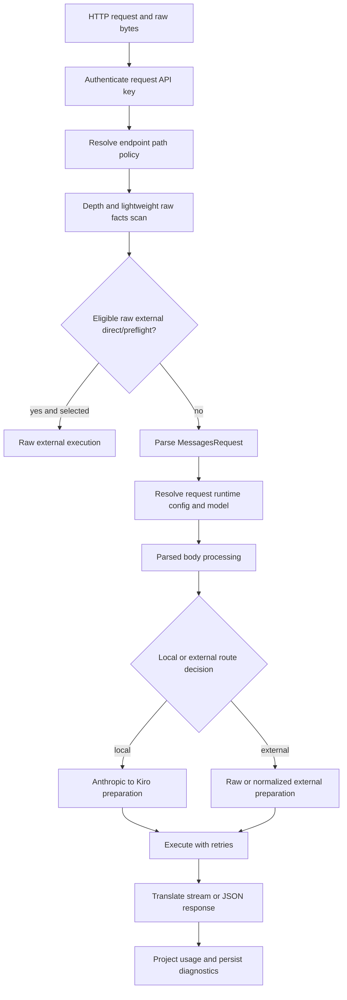
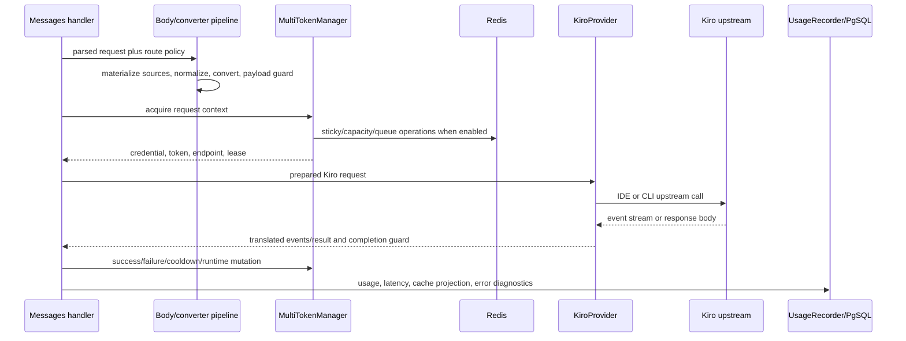
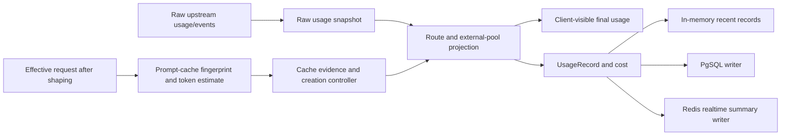
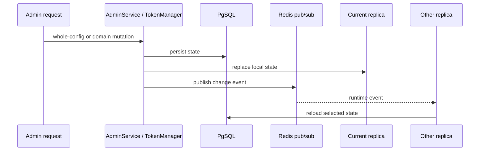

# Current Runtime Flows

Role: Project-wide factual baseline
Status: Current
Authority: Describes current process and request behavior; it does not prescribe the target pipeline
As of: `v0.0.102`, commit `e9479df71ee0`, 2026-07-11
Read when: Tracing a request, state mutation, background write, startup, reload, or shutdown
Related: [Business context](business-context.md), [System context](system-context.md), [Storage and state](storage-and-state.md)

## Route Resolution

`src/anthropic/router.rs` mounts built-in route entrypoints. Runtime cache, usage,
prompt-steering and external-pool behavior is selected by configuration using the
actual endpoint path; built-in route addresses are not immutable strategy names.

| Path | Messages handler | Historical default policy | Special contract |
| --- | --- | --- | --- |
| `/v1/messages` | `post_messages` | current-high-cache | General Anthropic compatibility |
| `/na/v1/messages` | `post_messages_na` | no-cache | Built-in entrypoint; cache/usage can be changed by path policy |
| `/ha/v1/messages` | `post_messages_ha` | current-high-cache | Built-in entrypoint; cache/usage can be changed by path policy |
| `/dfcache/{route}/v1/messages` | `post_messages_dfcache` | current-high-cache with path namespace | Route name must be explicitly configured |
| `/cc/v1/messages` | `post_messages_cc` | current-high-cache plus Claude Code prompt default | Claude Code event/usage compatibility |

Models, Files, and count-tokens routes are mounted for the same route families. The global HTTP request-body limit is 50 MiB.

## Messages Request Entry

Current details:

1. `request_entry::handle_messages_endpoint` receives `Bytes` and obtains a dynamic runtime configuration.
2. An independent JSON-depth scan rejects bodies deeper than the configured hard limit before serde's unbounded-depth parser is used.
3. Lightweight raw facts can probe the top-level model and permit raw external direct/preflight handling without fully parsing or mutating the body.
4. If no raw path completes, the body is deserialized to `MessagesRequest` and passed to `post_messages_inner`.
5. `post_messages_inner` obtains another request runtime configuration, applies route policy, resolves model behavior, and coordinates local/external attempts.

The two runtime-config reads are a current implementation fact; they can observe different versions during a concurrent Admin update.

## Local Kiro Flow

Detailed local stages:

1. thinking trigger and compatibility normalization;
2. Files/remote source materialization in safe image-processing mode;
3. model mapping and supported-model validation;
4. Anthropic-to-Kiro conversion of system, history, tools, schemas, thinking, images, documents, and cache points;
5. payload measurement, repair, compression/shaping, and optional history trimming;
6. credential eligibility scan for enabled state, model support, priority, cooldown, RPM, concurrency, health, and previous attempts;
7. optional sticky lookup, dispatch queue admission, and local/Redis lease acquisition;
8. token refresh or API-key preparation;
9. endpoint-specific IDE/CLI envelope construction and Kiro HTTP call;
10. bounded retry/failover based on status and normalized error class;
11. streaming or non-streaming Anthropic response translation;
12. lease release, credential state mutation, usage projection, and background persistence.

The normal success path can synchronously bridge into PgSQL runtime-state mutation. Lease release first updates local state and can synchronously wait for a Redis critical operation before falling back to background retry.

## External Pool Flow

An external pool is selected by enabled state, auto-disable state, route mode, model support, body mode, priority, cooldown, and capacity.

### Raw Passthrough

1. Preserve authoritative inbound bytes.
2. Probe only the lightweight fields needed for policy and model resolution.
3. Optionally rewrite the top-level model when explicitly configured.
4. Forward bytes without parsed-body conversion or payload shaping.
5. Proxy streaming/non-streaming response data.
6. Either pass through usage or apply current-path usage projection according to pool configuration.

### Normalized Body

1. Parse the Anthropic request.
2. Apply enabled normalized-body transformations and model mapping.
3. Optionally apply the external payload guard.
4. Serialize a new outbound body.
5. Execute with external capacity lease, cooldown, retry, and auto-disable behavior.
6. Translate/proxy the response and record billing/usage.

`preservePath` is currently stored and exposed by the UI, but `external_pool_url` ignores its endpoint parameter and always constructs a Messages URL. This is a confirmed current contract defect.

## Cache And Reported Usage Flow

Current cache-related logic is distributed:

- `prompt_cache.rs` canonicalizes request blocks, tracks cache fingerprints, and estimates cache usage;
- `prompt_cache_creation_control.rs` limits when cache creation is reported;
- handler state applies route-specific policies and final stream/non-stream usage;
- external pools can preserve upstream usage or re-project it through current route policy;
- `usage.rs` stores final fields, raw metadata, cost, duration, route, and diagnostics.

The current representation does not enforce one explicit type boundary between raw usage, effective request facts, cache evidence, and reported usage.

## Files And Remote Content Flow

### Files-Compatible Upload

1. Authenticated multipart upload reaches `src/anthropic/files.rs`.
2. Empty or greater-than-50-MiB files are rejected.
3. Bytes are stored in a process-local `Arc<Vec<u8>>`.
4. Oldest live entries are evicted until the map is at most 128 files and 256 MiB total.
5. `file_id` content can later be materialized into a Messages request.

Explicit delete removes payload/map state but does not remove the ID from the FIFO `order` queue. Repeated upload/delete churn can therefore grow metadata and list-scan cost despite live count/bytes remaining bounded. Files also disappear on process restart and are not shared between replicas. In the single-user model these are resource and availability/compatibility limitations, not cross-user authorization defects.

### Remote Image Or Document

1. Safe image-processing mode accepts HTTP/HTTPS URL sources.
2. A new reqwest client is built for the request with a 25-second timeout.
3. Each remote source is processed serially.
4. DNS/IP safety is checked before reqwest performs its own resolution and connection.
5. Each response is accumulated up to 20 MiB, encoded as base64, and written back into request JSON.

There is no current per-request source count, aggregate downloaded byte, aggregate materialized byte, or global download concurrency budget.

## Count Tokens Flow

Count-tokens endpoints parse and preprocess request content, including enabled file/remote materialization. Local token estimation scans messages, tools, schemas, thinking, and media metadata. If a remote count-tokens URL is configured, `src/token.rs` bridges from synchronous counting code into an async HTTP request and falls back to local counting on failure.

## Admin Mutation And Runtime Reload

Current properties:

- runtime configuration is saved as a whole JSON document and its version is incremented, but the update does not require an expected version;
- request API keys are refreshed when a runtime-config event reloads;
- the per-process `AdminState` key is not refreshed by the same listener;
- model capability and pricing updates do not have a complete cross-replica invalidation path;
- usage cleanup job status/cancellation is held in process memory.

## Usage Persistence And Query

1. A completed or failed request creates a normalized `UsageRecord`.
2. The record is appended to a bounded in-memory recent-record deque.
3. PgSQL and Redis writers accept records through bounded queues.
4. Queue saturation waits briefly and can enter synchronous persistence fallback.
5. PgSQL stores the record and updates multiple rollup tables.
6. Redis stores snapshots and realtime derived aggregates.
7. Admin queries prefer memory/Redis for some views and fall back to PgSQL.

PgSQL batch handling still awaits many per-record/per-rollup operations. Redis usage snapshot, deduplication marker, and aggregate update are separate operations; a failure after the marker can create a temporary or permanent derived-count gap.

## Startup Flow

1. Load file configuration and optional CLI credential diagnostics.
2. Retry PgSQL and Redis connection/initialization for up to 60 seconds.
3. Bootstrap file configuration and credentials only when durable rows are absent.
4. Load runtime configuration, credentials, runtime state, usage stores, catalogs, and caches.
5. Build schedulers/providers/managers and spawn background workers.
6. Attempt model/pricing synchronization without making request serving depend on success.
7. Bind the configured listener and serve all route families.

PgSQL and Redis are mandatory for server startup. Model/pricing refresh failure degrades to existing/built-in catalogs.

## Shutdown Flow

1. Receive Ctrl-C or SIGTERM.
2. Stop accepting through Axum graceful shutdown and wait within the server budget.
3. Flush and drain credential statistics/runtime mutations.
4. Drain usage and storage queues within shared deadlines.
5. Stop background tasks and report accepted/finished/abandoned counts.
6. Panic only for incomplete credential-stat shutdown or HTTP server failure.

Usage or general storage abandonment is currently logged but does not independently force a non-zero process exit. Untracked Admin audit tasks and process-local cleanup jobs are not part of a single lifecycle registry.

## Cancellation And Slow Paths

- Completion and lease guards use `Drop` to release capacity when request futures are cancelled.
- Streaming is pull-based; a connected client that stops polling can retain upstream/body/lease state until another timeout or disconnect occurs.
- Kiro stream idle timeout is configurable and should not be confused with total execution time.
- Upstream first-byte delays above 30 or 60 seconds and total durations above 180 seconds are legitimate validation scenarios.
- Remote source materialization has a separate 25-second HTTP-client timeout and should remain governed by a tighter resource-fetch policy than model execution.
