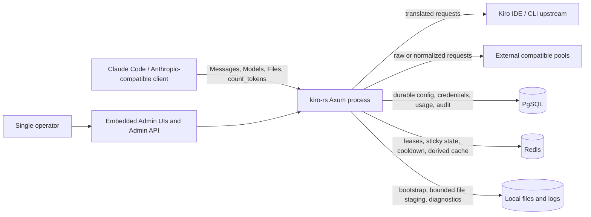

# Current System Context

Role: Project-wide factual baseline
Status: Current as of 2026-07-11
Authority: Describes the deployed components and current ownership boundaries; target design lives in active plans
As of: `v0.0.102`, commit `e9479df71ee0`, 2026-07-11
Read when: Locating a runtime responsibility, dependency, source of truth, or process lifecycle owner
Related: [Business context](business-context.md), [Module map](module-map.md), [Runtime flows](runtime-flows.md), [Storage and state](storage-and-state.md)

## Context Diagram

The diagram has one operator trust domain. Client API keys do not create separate users. Kiro, external pools, PgSQL, Redis, remote URLs, and the filesystem remain separate operational or security boundaries.

## Runtime Composition

`src/main.rs` currently performs all process assembly:

1. parse CLI arguments and initialize tracing;
2. load `config.json` as bootstrap input;
3. connect to mandatory PgSQL and Redis dependencies with bounded startup retry;
4. bootstrap runtime configuration and credentials into PgSQL when absent;
5. load runtime configuration, credentials, runtime state, model capabilities, and pricing;
6. construct `MultiTokenManager`, `KiroProvider`, `ExternalPoolManager`, `UsageRecorder`, caches, catalogs, and request-key state;
7. spawn runtime-event, statistics, catalog, and storage/usage background work;
8. mount Anthropic, Admin, UI, health, and readiness routes;
9. serve until termination, then drain selected background components.

Important construction evidence:

- mandatory PgSQL and Redis startup: `src/main.rs:92-111`;
- file-to-PgSQL runtime bootstrap: `src/main.rs:121-180`;
- token manager and provider creation: `src/main.rs:325-357`;
- Anthropic router dependencies: `src/main.rs:418-431`;
- Admin service assembly: `src/main.rs:441-476`;
- health router merge: `src/main.rs:480-485`.

## Current Logical Components

| Component | Current owner | Main responsibilities |
| --- | --- | --- |
| HTTP composition | `src/main.rs`, `src/anthropic/router.rs`, `src/admin/router.rs` | Route mounting, middleware, dependency construction, lifecycle |
| Request application state | `src/anthropic/middleware.rs::AppState` | Request keys, provider, cache policy, conversion flags, catalogs, file store, usage, external manager |
| Messages orchestration | `src/anthropic/handlers.rs` and `handlers/*` | Parse, policy resolution, local/external routing, retry, stream/non-stream response, usage |
| Request conversion | `src/anthropic/converter.rs` and `converter/*` | Anthropic-to-Kiro body conversion, tools, thinking, schema, content, history |
| Body/resource processing | `src/anthropic/body_processing.rs`, `payload_guard*.rs` | Remote/file materialization, media normalization, shaping, size guard |
| Local credential scheduling | `src/kiro/token_manager/manager.rs` and submodules | Eligibility, priority/balancing, sticky sessions, RPM, cooldown, concurrency, refresh, persistence |
| Kiro transport | `src/kiro/provider.rs`, `src/kiro/endpoint/*`, `src/kiro/parser/*` | Endpoint-specific envelopes, HTTP, retries, streaming parser, completion reporting |
| External routing | `src/external_pool.rs` and `external_pool/*` | Pool selection, body mode, leases, transport, failover, usage projection |
| Cache policy | `src/anthropic/prompt_cache.rs`, `prompt_cache_creation_control.rs`, config policy types | Prefix tracking, bounds, creation frequency, reported cache usage |
| Usage and cost | `src/anthropic/usage.rs`, pricing/model catalogs | In-memory recent records, async writers, dashboards, pricing, diagnostics |
| Admin control plane | `src/admin/*` | Credentials, proxy resources, pools, runtime config, usage, catalogs, security keys, audits |
| Durable storage | `src/storage/postgres.rs` | Schema migration and all durable repositories in one implementation |
| Coordination/cache | `src/storage/redis_cache.rs` | Leases, sticky binding, cooldown, queues, runtime events, usage summaries |
| Local file staging | `src/anthropic/files.rs` | Process-local Anthropic Files-compatible live payload staging with count/byte bounds; explicit-delete tombstones can grow ordering metadata |
| Diagnostic recording | tracing and `src/anthropic/tool_format_debug.rs` | Process logs and JSONL tool-format diagnostics |

## Current Deployment Topology

The minimum supported server deployment is:

- one `kiro-rs` process;
- one reachable PgSQL database;
- one reachable Redis instance;
- network access to Kiro and any configured external/remote-content upstreams.

The code also contains cross-process Redis leases, sticky bindings, refresh locks, runtime events, and PgSQL compare-and-swap mechanisms for selected credential state. These mechanisms show multi-replica intent, but the formal supported-production-mode decision remains open. Any replicas still serve the same single-user product.

The current Compose deployment mounts `./config` and `./logs`, publishes the application port, and uses a TCP health check. The application itself exposes `/healthz` and dependency-aware `/readyz`.

## Current Data Authority

| Data | Durable authority | Coordination or derived state | Process-local copy |
| --- | --- | --- | --- |
| Runtime configuration | PgSQL `runtime_config` | Redis change notification | `Config` clones in token manager, app state, request state |
| Kiro credentials | PgSQL `credentials` | Redis refresh locks, leases, sticky/cooldown state | `CredentialEntry` collection |
| Credential runtime state | PgSQL runtime/mutation tables | Redis capacity and transient state | token-manager entries and pending mutations |
| External pool definitions | PgSQL | Redis leases, cooldown, availability hints | manager availability cache |
| Usage records and rollups | PgSQL | Redis realtime summaries/cache | bounded recent-record deque |
| Model capabilities and pricing | PgSQL plus built-in/default sources | runtime change notification is incomplete | in-memory catalogs |
| Request API keys | PgSQL-backed runtime config | runtime config event | in-memory `RequestApiKeyStore` |
| Admin key | PgSQL-backed runtime config | no complete cross-replica refresh | `AdminState` per process |
| Prompt cache tracker | none | none | bounded in-memory tracker |
| Uploaded Files-compatible objects | none | none | live payload/count bounded; ordering metadata has a delete-tombstone growth defect |
| Tool-format debug records | local JSONL files | none | bounded channel, unbounded directory lifetime |

## Current Architectural Shape

The project is not completely unmodularized. It already has dedicated converter, endpoint, parser, token-manager algorithm, external body/model/retry/usage, Admin, and storage modules. The structural problem is that ownership and orchestration remain concentrated in a few broad objects:

- `MultiTokenManager` owns scheduling, refresh, local state, PgSQL, Redis, queues, and Admin mutations;
- `handlers.rs` owns policy, routing, conversion coordination, retries, response translation, and usage;
- `PostgresStore` and `RedisStore` expose broad domain-specific APIs instead of narrow repository ports;
- `AdminService` reaches across most runtime domains;
- `Config`, `AppState`, and `RequestRuntimeConfig` duplicate overlapping state.

Large files are therefore a symptom of wide responsibility and dependency direction. Splitting them without changing ownership would improve navigation but not correctness, testability, or request-path cost.

## Boundary Summary

### Stable External Boundaries

- Anthropic-compatible HTTP and SSE contract;
- Claude Code-specific behavior on `/cc/v1`;
- Kiro IDE/CLI request and event protocols;
- external pool raw/normalized HTTP behavior;
- PgSQL durable schema and Redis key/lease semantics;
- Admin API and both maintained UI contracts.

### Unstable Internal Boundaries

- request policy snapshot versus mutable global config;
- pure scheduling decisions versus storage/network coordination;
- raw usage versus cache evidence versus reported usage;
- domain records versus PgSQL/Redis DTOs;
- background write acceptance versus durable completion;
- Admin commands versus runtime state mutation and broadcast.

The [Greenfield AI Gateway plan](../plans/greenfield-ai-gateway/README.md) must replace these unstable internal boundaries while preserving or explicitly superseding the external behavior.
