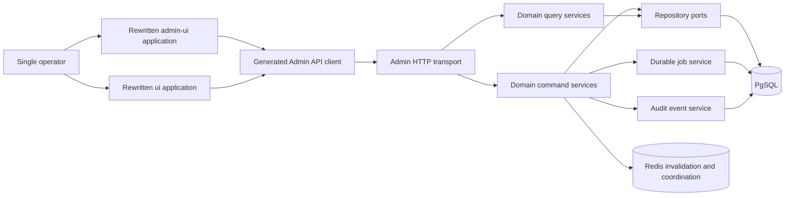

# Admin And Frontend Architecture

Role: Accepted control-plane backend and maintained-frontend target architecture

Status: Accepted; implementation Not Started

Authority: Binding Admin/service/API/UI boundaries under decisions 007-014; existing code remains current-behavior authority until the complete target activates

As of: `v0.0.102`, commit `e9479df71ee0`, updated 2026-07-12

Read when: Rewriting Admin services, routes, contracts, jobs, audits, `admin-ui`, `ui`, or frontend validation

Related: [Target architecture](target-system-architecture.md), [Module contracts](module-boundaries-and-contracts.md), [State ownership](state-ownership-and-consistency.md), [Admin secret finding](../problems/correctness-security-and-resource-bounds.md#sec-005-admin-reads-and-browser-storage-retain-reusable-secrets), [Requirements](../requirements-and-quality-attributes.md), [Admin existing plan](../../../admin-observability-routing-config/README.md), [R8 plan](../delivery/migration-sequence.md#dependency-group-r8-admin-backend-contract-browser-both-frontends)

## Authority Notice

Decisions 007-014 require both maintained Admin frontends and their backend control plane in the one complete target. Retirement still requires a separate product decision; until then, `/admin` and `/ui` both consume the same generated authoritative API contract and release together.

## Current Boundary

The current control plane consists of:

- `src/admin/router.rs` and `src/admin/handlers.rs` for HTTP routes and DTO conversion;
- `src/admin/service.rs` for more than 80 operations across credentials, proxies, pools, config, usage, models, pricing, security, jobs, and audit;
- `src/admin/middleware.rs::AdminState` for process-local Admin key validation;
- `src/admin/types.rs` for Rust request/response DTOs;
- `admin-ui` and `ui` as two maintained frontend applications;
- ordinary Admin reads that return reusable request/Admin keys and stored proxy passwords rather than masked lifecycle metadata;
- `admin-ui/src/lib/storage.ts` and `ui/src/lib/storage.ts`, which retain the reusable Admin key indefinitely in JavaScript-readable `localStorage`;
- large handwritten TypeScript contract surfaces duplicated between the two frontends;
- `scripts/check-frontend-contracts.mjs`, which compares frontend copies rather than deriving them from Rust.

The target must preserve the behavior landed by the Admin observability/routing plan while replacing this ownership shape. Plaintext recovery through ordinary reads and indefinite browser retention are the registered `SEC-005` defect, not compatibility behavior to preserve.

## Target Context



Both UIs belong to the same operator trust domain. They do not create user, role, organization, or tenant contexts.

## Backend Control-Plane Modules

```text
application/admin/
  credentials/
    commands.rs
    queries.rs
  proxy_resources/
  external_pools/
  runtime_config/
  usage/
  catalogs/
  security/
  jobs/
  audit/
  system/

transport/admin_api/
  auth.rs
  error.rs
  routes/
    credentials.rs
    proxy_resources.rs
    external_pools.rs
    runtime_config.rs
    usage.rs
    catalogs.rs
    security.rs
    jobs.rs
    audit.rs
    system.rs
```

Rules:

- HTTP handlers own authentication, path/query/body extraction, schema DTOs, status codes, and response mapping only.
- After header authentication and endpoint/profile resolution, Admin transport captures `MOD-RUNTIME-CONFIG` exactly once; using that captured version, and before body extraction/allocation, it acquires a scoped `MOD-RESOURCE-GOVERNOR` handle. `Content-Length` reserves up front, chunked input upgrades incrementally, and downstream receives only `BoundedRawBody` plus narrow views from that same capture.
- Command services own validation and one explicit mutation transaction/use case.
- Query services own read models and pagination/filter semantics but not HTTP response types.
- Credential and scheduler commands use repository/application ports, never `MultiTokenManager` fields or broad locks.
- Storage operations are async end to end; no Admin service uses `block_in_place` to hide I/O.
- Runtime config commands require expected version and return conflict explicitly.
- Cleanup and long-running maintenance are durable jobs, not process-local task maps.
- Audit is a required durable event for successful or rejected privileged mutations according to the accepted durability policy.

The backend domain and UI workflow IDs are stable planning identities. The [execution slice map](../../indexes/execution-slice-map.md#r8-admin-authorities-generated-contract-browser-harness-both-uis) remains authoritative for exact dependencies:

| Domain slug | State/command owner | Backend slice | Two required UI workflow slices |
| --- | --- | --- | --- |
| `runtime-config` | `MOD-RUNTIME-CONFIG` | `R8.1.runtime-config` | `R8.4.admin-ui.runtime-config`, `R8.4.operator-ui.runtime-config` |
| `auth` | `MOD-AUTH` | `R8.1.auth` | `R8.4.admin-ui.auth`, `R8.4.operator-ui.auth` |
| `model-catalog` | `MOD-MODEL-CATALOG` | `R8.1.model-catalog` | `R8.4.admin-ui.model-catalog`, `R8.4.operator-ui.model-catalog` |
| `credentials` | `MOD-CREDENTIALS` | `R8.1.credentials` | `R8.4.admin-ui.credentials`, `R8.4.operator-ui.credentials` |
| `proxy-resources` | `MOD-PROXY-RESOURCES` | `R8.1.proxy-resources` | `R8.4.admin-ui.proxy-resources`, `R8.4.operator-ui.proxy-resources` |
| `external-pools` | `MOD-EXTERNAL-POOLS` | `R8.1.external-pools` | `R8.4.admin-ui.external-pools`, `R8.4.operator-ui.external-pools` |
| `usage` | `MOD-USAGE` | `R8.1.usage` | `R8.4.admin-ui.usage`, `R8.4.operator-ui.usage` |
| `audit` | `MOD-AUDIT` | `R8.1.audit` | `R8.4.admin-ui.audit`, `R8.4.operator-ui.audit` |
| `maintenance-jobs` | `MOD-MAINTENANCE-JOBS` | `R8.1.maintenance-jobs` | `R8.4.admin-ui.maintenance-jobs`, `R8.4.operator-ui.maintenance-jobs` |

`validation` and `overview-system` are cross-domain UI workflows, not new backend state owners. Each has one exact `R8.4.<app>.<workflow>` slice per maintained application. System/version remains a state-free `MOD-TRANSPORT-ADMIN` query, and readiness/worker-health facts remain owned by `MOD-READINESS` in R9.

For reusable proxy resources, the complete structural chain is `R2.4.proxy-resources -> R4.0 -> R8.1.proxy-resources -> R8.4.admin-ui.proxy-resources/R8.4.operator-ui.proxy-resources`. The owner controls versioned CRUD, masked secret replacement, connectivity tests, immutable catalog publication, credential binding resolution and client invalidation; Admin transport and credential/scheduler consumers do not own a second catalog.

## Command Contract

Each mutation has a narrow command rather than a complete mutable service object:

```rust
pub struct UpdateRuntimePolicy {
    pub expected_version: ConfigVersion,
    pub patch: RuntimeConfigPatch,
    pub actor: AdminActor,
    pub request_id: RequestId,
}

pub enum CommandResult<T> {
    Applied(Versioned<T>),
    Conflict { current_version: Version },
    Rejected(ValidationError),
}
```

Secrets are write-only or explicitly reveal-once. Response DTOs do not echo submitted credentials, tokens, passwords, or complete proxy URLs with embedded authentication.

## Query Contract

Read models are tailored to operator workflows:

- credential list/summary/runtime/account-info;
- reusable proxy-resource list/summary/test state with redacted secret metadata and catalog version;
- external pool status/capacity/cooldown/last failure;
- usage records, exact request/error IDs, series, top/breakdown, writer/outbox state;
- runtime configuration sections and their common version;
- model capability/pricing catalog and sync state;
- audit events and durable job progress;
- readiness, worker health, resource budgets, config applied-version lag, and diagnostic quota state.

Pagination uses stable sort keys/cursors where possible. Generic search must not silently scan arbitrary large JSON bodies. Filters have the same semantics across memory/cache/PgSQL paths.

## Secret And Browser Session Contract

This is the accepted architecture realization of `FUN-025` and `QA-SEC-007` for `SEC-005`.

Secret authority remains with the module that owns the secret lifecycle; Admin transport and either browser application are never secret authorities:

| Contract surface | Technical authority | Accepted boundary |
| --- | --- | --- |
| Request/Admin key lifecycle | `MOD-AUTH` | Create, rotate, revoke, authenticate, and return masked ID/fingerprint/version/lifecycle metadata; plaintext is available only through an explicitly authorized reveal-once result. |
| Credential, reusable-proxy, pool, and runtime secret fields | `MOD-CREDENTIALS`, `MOD-PROXY-RESOURCES`, `MOD-EXTERNAL-POOLS`, and `MOD-RUNTIME-CONFIG`, respectively | Ordinary reads return presence/mask/fingerprint metadata; writes use typed `Keep`, `Replace`, or `Clear` intent and never echo the stored plaintext. |
| HTTP mapping | `MOD-TRANSPORT-ADMIN` | Map authorized create/rotate/reveal-once results separately from ordinary query DTOs, attach `Cache-Control: no-store` and equivalent cache protections, and never place a secret in a URL or generic error envelope. |
| Schema and client | `MOD-FRONTEND-CONTRACT` | Mark submitted secrets `writeOnly`; represent reveal-once results as a distinct non-reloadable type that cannot be mistaken for an ordinary read model. |
| Browser session and reveal display | `MOD-ADMIN-UI` and `MOD-OPERATOR-UI` | Hold only the minimum accepted session state, never persist a reusable Admin credential in `localStorage`, clear retained state on logout/revocation/expiry, and discard a reveal-once value after the explicit display/copy workflow. |

A reveal-once contract has explicit authorization, audit attribution, expiry or single-consumption behavior, and no later recovery through GET/list/reload/export. Response-cache directives are defense in depth; they do not replace the server-side lifecycle rule. Target commands may accept characterized old write aliases at the HTTP boundary only when they map immediately to typed intent; no target query reproduces plaintext reads and no legacy DTO remains in the generated client.

Browser authentication exchanges the reusable Admin key over a same-origin no-store login request for a random short-lived host-only `HttpOnly`, `Secure`, `SameSite=Strict` session cookie. `MOD-AUTH` stores only keyed constant-time verifiers/fingerprints plus auth epoch for API keys and only a session-token verifier plus epoch in bounded shared Redis session state with 15-minute idle TTL and 8-hour absolute lifetime; it never uses the reversible secret envelope for verify-only keys. Mutations require an in-memory same-origin CSRF token and the decision-010 current-epoch check. Logout/revoke removes the session; Redis loss invalidates sessions fail-closed. Loopback development may explicitly relax `Secure` only in a non-production profile. Both old `localStorage` keys are removed, never migrated into another durable browser store, and reload requires the cookie or re-authentication.

## API Contract Authority

The Rust Admin HTTP schema is the authority. The build produces a versioned OpenAPI or equivalent machine-readable schema and a generated TypeScript client/types package.

Required flow:

```text
Rust route and DTO schema
-> checked schema artifact
-> generated TypeScript client/types
-> admin-ui and ui imports
-> component/browser contract tests
```

Rules:

- Frontends do not maintain independent copies of API request/response types.
- Generated files are reproducible and checked for drift in CI.
- The schema marks write-only secrets, masked read metadata, reveal-once results, nullable/optional distinctions, enums, version/conflict fields, pagination, and error envelopes.
- Target HTTP mapping may preserve characterized route/field aliases when they map to the same target command, but duplicate handwritten DTOs and legacy adapters are deleted before final candidate freeze.
- A route present in only one UI is still part of the authoritative schema.

## Frontend Repository Shape

Both applications keep their existing deployable/mount identities during rewrite, but use the same internal feature boundaries:

```text
admin-ui/src/ or ui/src/
  app/
    router/
    providers/
    layout/
  api/
    generated/          generated package import or output
    query-keys.ts
    errors.ts
  features/
    auth/
    credentials/
    proxy-resources/
    external-pools/
    runtime-config/
    usage/
    catalogs/
    jobs/
    audit/
    system-health/
  components/
    primitives/
    data-table/
    forms/
    feedback/
  test/
    fixtures/
    render.tsx
```

The precise framework/library selection follows existing repository choices unless a later decision changes it. Feature boundaries matter more than creating a shared package for every visual component.

## Shared Versus Separate Frontend Code

Must be shared/generated:

- Admin API client and types;
- error/version/conflict semantics;
- API fixtures derived from schema;
- stable query-key naming contract;
- security rules for secrets and authentication state.

May remain application-specific:

- navigation and layout;
- visual components/design systems;
- information density and workflow composition;
- route URLs inside each application;
- progressive migration adapters.

Do not force a shared component library merely to remove duplicated CSS. Share only code with one stable owner and compatible product behavior.

## Frontend State Rules

- Server state uses explicit query keys and invalidation per domain/version.
- Forms own drafts; server objects are not mutated in place.
- A runtime-config edit starts from a recorded version and displays `409` conflict with reload/reapply options.
- Mutations disable only the affected command, not the entire application.
- Long-running jobs show durable job ID, state, progress, cancellation result, and last error.
- Secret fields never repopulate from masked placeholders and never enter local storage, URL, analytics, or error text.
- The reusable Admin credential never enters either application's `localStorage`, `sessionStorage`, IndexedDB, service-worker cache, persisted query cache or serialized store; the accepted HttpOnly session design is the only production browser profile.
- Auth rotation clears stale session state and verifies the new Admin key against the converged backend.
- Optimistic UI is used only when rollback is deterministic; credential/pool/security mutations prefer server-confirmed state.

## Domain Workflows

### Credentials

- list, filter, page, inspect runtime/account state;
- import/export under explicit secret policy;
- edit auth, priority, enabled, models, RPM, regions, proxy, warmup, overage;
- refresh/test/reset and observe attempts/errors;
- distinguish durable configuration from transient scheduler state.

### Proxy Resources

- list, create, version-patch, disable/delete and test reusable HTTP/SOCKS resources through `MOD-PROXY-RESOURCES`;
- show endpoint class, enabled/bound status, catalog version and masked secret metadata without reconstructing a complete credential-bearing URL;
- use explicit `Keep`, `Replace` or `Clear` secret commands and never repopulate a form from a mask;
- expose binding conflicts, missing/disabled references, replica publication lag and affected-client retirement as typed outcomes;
- preserve direct credential override versus reusable-resource precedence without moving credential or scheduler ownership into this workflow.

### External Pools

- configure URL/auth/model/body/usage/path/capacity/error policy;
- present `preservePath` as an actual contract and preview canonical outbound path;
- test without leaking headers/secrets;
- expose cooldown, auto-disable, in-flight, queue, last failure, and projection state.

### Runtime Configuration

- group settings by routing, scheduler, body/resources, cache/usage, external, diagnostics, lifecycle;
- carry one expected version across a patch;
- normalize and validate before submit;
- expose conflict and applied-version lag.

### Usage And Operations

- exact request/error ID lookup;
- consistent route/model/credential/pool/status/cache filters;
- raw-versus-reported-versus-billable usage explanation through values and labels, not hidden formulas;
- writer/outbox backlog, dropped/abandoned state, readiness, worker health, debug quota, and cleanup job state.

## Security And Accessibility

- Admin key remains separate from data-plane request keys.
- Admin key rotation/revocation follows decision 010; a replica that cannot prove a sufficiently current auth epoch rejects privileged mutations.
- Browser storage contains no long-lived raw secret unless an accepted auth design explicitly requires and protects it.
- API errors are rendered as safe structured messages; raw HTML is never trusted.
- Clipboard/export actions for secrets require explicit operator intent and audit where applicable.
- Forms have labels, validation association, keyboard support, focus management, and non-color-only status.
- Tables and dense operational views support keyboard navigation and responsive overflow without hiding required actions.
- Both desktop and mobile viewports must avoid overlapping controls/text and preserve the primary workflow.

## Frontend Performance

- Route/feature code is split so opening one domain does not require every Admin feature bundle where the framework supports it.
- Large tables paginate or virtualize only when measurement requires it; filtering remains server-side for durable data.
- Query retries are bounded and do not create mutation loops.
- Polling is centralized, visibility-aware, and suspended for inactive views where safe.
- High-cardinality usage results do not remain duplicated in multiple global stores.

## Test Architecture

### Capability-To-Test Matrix

| Domain capability | Current route groups to preserve | Required characterization and rewritten E2E |
| --- | --- | --- |
| Credential lifecycle | add/delete, import/export, batch update, delete disabled | valid/invalid batches, duplicate identity, secret redaction, partial failure, rollback |
| Credential authentication | `/{id}/auth`, validation existing/external, force refresh | `social`, `idc`, `external_idp`, `api_key`; expiry, refresh winner, permanent failure, masked output |
| Credential scheduling controls | disabled, priority, concurrency, RPM, rate-limit auto-disable, models, regions, warmup, proxy, in-flight clear, reset | persisted patch, scheduler eligibility effect, conflict, cross-replica reload if supported |
| Credential account operations | balance, info, credit/usage summary, overage, refresh info, test | Kiro response/error mapping, stale state, timeout, proxy/region choice, no secret logging |
| Model support | set/sync/discover supported models | IDE/CLI discovery, allowed/blocked dispatch, empty means unrestricted, error/recovery |
| Proxy resources | CRUD and test config/resource | HTTP/SOCKS, auth redaction, connect failure, credential/global precedence |
| External pools | CRUD, enabled, models set/sync/discover, auto-disable clear, test/status | raw/normalized, preservePath, auth/header boundary, capacity/cooldown, auto-disable/recovery |
| Usage and cleanup | records/page/clear/preview/start/status/cancel, summary/dashboard/windows/series/top/breakdown/billing/writer stats | exact filters, pagination, raw/reported/billable/cache values, durable job restart/cancel |
| Runtime configuration | load balancing and full runtime patch | version read, validation, `409`, reload/reapply, applied-version lag |
| Security and audit | Admin key, request keys CRUD, audit logs | reveal-once/masking, rotation/revocation, old/new key convergence, actor/request attribution |
| Catalogs | pricing/capability read/sync/manual CRUD | source/version/status, failure fallback, replica convergence if supported |
| System | version, readiness/worker/resource state | degraded/not-ready/recovery and exact build/source identity |

### Credential Compatibility Matrix

R5/R8 characterization must cover supported combinations, not only one happy-path credential:

| Dimension | Required values |
| --- | --- |
| Kiro endpoint | IDE, CLI |
| Authentication | `social`, `idc`, `external_idp`, `api_key` |
| Proxy | direct, global fallback, credential override, proxy-resource reference; HTTP/SOCKS where supported |
| Region | global default, credential auth region, credential API region |
| Token state | valid, near expiry, expired-refreshable, refresh rejected, API-key no-refresh |
| Model | discovered supported, manually supported, unsupported, alias resolution |

The suite records unsupported combinations explicitly instead of silently skipping them. Pairwise coverage is acceptable for network/proxy/region combinations only after every authentication method and both endpoints have their own direct characterization.

### Schema And Unit

- generated-client drift;
- enum/optional/secret/version/error mapping;
- form normalization and patches;
- query key and invalidation rules;
- conflict and safe error handling.

### Component

- credential and external-pool edit workflows;
- `preservePath` toggle/preview;
- runtime config version conflict;
- usage filters and pagination;
- job progress/cancel;
- secrets never echoed or retained.

### Browser E2E

- Admin login and key rotation;
- credential/proxy/pool CRUD and test;
- runtime config patch/conflict/reload;
- model/pricing synchronization;
- usage exact search/dashboard;
- cleanup/audit/system health;
- backend error/readiness/recovery;
- desktop/mobile layout and no-overlap checks.

The backend fixture is isolated and deterministic. Tests must not use production credentials, databases, Redis prefixes, ports, or the operator's ordinary browser session.

## R8 Dependency Work

Backend and UI work is implemented in dependency order inside the target-only candidate:

1. generated schema/client plus safe auth/error and isolated browser-harness foundations;
2. state-free system/version and runtime-config version reads; readiness/worker-health integration remains an R9 dependency;
3. `R8.1.credentials` and the independently owned `R2.4.proxy-resources -> R4.0 -> R8.1.proxy-resources` backend chain;
4. external pools and `preservePath`;
5. usage queries/dashboard/outbox state;
6. catalogs/pricing;
7. durable jobs and audit;
8. security key rotation;
9. remaining system/config surfaces;
10. old Admin service methods, duplicate TypeScript types, and legacy feature implementations deleted.

For each backend domain, both exact frontend workflows are rewritten against the generated client before old backend/type code is removed. The nine domain workflows plus `validation` and `overview-system` are coding/test units, not production switches. Both complete apps enter the one final release unless a separate retirement decision changes product scope.

The auth work unit characterizes and deletes both current browser storage keys. Its tests prove session expiry/revocation/CSRF/XSS-sensitive boundaries/multi-tab behavior and whole-system rollback access without restoring persistent browser keys.

## Acceptance Conditions

- No Admin handler or frontend calls a broad God Object or concrete storage adapter.
- All storage I/O is async and visible through domain ports.
- Runtime config updates use expected-version conflict semantics end to end.
- Key/catalog changes converge according to the accepted deployment mode.
- Cleanup and audit state is durable/supervised according to the accepted event policy.
- Both frontends use one Rust-authoritative generated contract and contain no duplicate handwritten API model file.
- Ordinary read/list/reload/export responses expose only masked secret metadata; reveal-once responses are distinct, non-cacheable, audited where required, and cannot be recovered after reload.
- Unique secret-marker tests prove neither maintained frontend retains the reusable Admin credential or revealed values in JavaScript-readable persistent storage, browser artifacts, logs, errors, analytics, or exported evidence.
- Both frontends pass schema, unit, component, browser, production-build, security, accessibility, desktop, and mobile gates.
- Every old backend/frontend responsibility is deleted before final candidate freeze; no compatibility fork remains in target artifacts.
