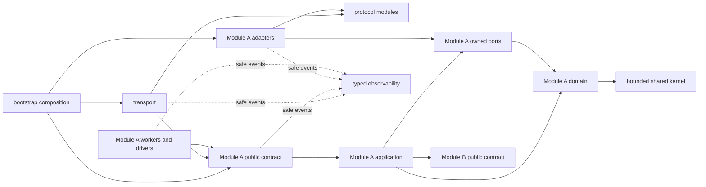

# Module Boundaries And Contracts

Role: Accepted module technical-authority and interface contract

Status: Accepted; implementation Not Started

Authority: Defines binding dependency rules and public interface semantics under decisions 003-014; none should be treated as implemented until source/evidence exists

As of: `v0.0.102` / `e9479df` / updated 2026-07-12

Read when: Moving code, adding an abstraction, changing a handler, scheduler, storage adapter, upstream client, background task, or deciding where a new capability belongs

Related: [Target architecture](target-system-architecture.md), [Target module ledger](../../indexes/target-module-ledger.md), [Decision 007](../../decisions/007-domain-oriented-modular-monolith-and-module-ownership.md), [Decision 009](../../decisions/009-single-program-modular-build-and-final-cutover.md), [Runtime flows](runtime-control-and-data-flows.md), [State ownership](state-ownership-and-consistency.md), [Accepted decisions](../../decisions/README.md), [Request-body capability plan](../../../request-body-capability-modularization/README.md), [Problem catalog](../problems/README.md)

## Authority Notice

Decisions 007-014 accept these end-state boundaries and target-only implementation model. This document does not assert that current large modules satisfy them. Existing public behavior remains the characterization baseline until the complete target is implemented, verified and activated; target runtime never composes a legacy fallback.

The contracts assume one operator and one trust domain. They deliberately contain no tenant, user, organization, tenant context, per-key ownership, or tenant repository type.

## Contract Map

This file is intentionally a cross-module contract catalog. Use the smallest section needed:

| Concern | Section |
| --- | --- |
| Layering and forbidden imports | [Dependency direction](#dependency-direction) and [boundary rule](#boundary-rule) |
| HTTP, request snapshot, facts, routing, and body work | [Transport contracts](#transport-contracts) through [body pipeline contracts](#body-pipeline-contracts) |
| Queue, lease, upstream, replay, response, and terminal state | [Scheduler contracts](#scheduler-contracts) through [terminal outcome contracts](#terminal-outcome-contracts) |
| Usage, model/catalog, repositories, Files/media, and workers | [Usage and accounting contracts](#usage-and-accounting-contracts) through [worker and lifecycle contracts](#worker-and-lifecycle-contracts) |
| Legacy characterization, offline comparison, and gate authority | [Legacy characterization boundary](#legacy-characterization-boundary) and [contract verification](#contract-verification) |

## Dependency Direction

The roles below are applied inside a stable `MOD-*` ownership boundary. They are not global horizontal modules into which unrelated domains place code.



### Allowed Dependencies

- `bootstrap` may depend on all concrete modules because it is the composition root; it performs no business branching.
- `transport` may depend on protocol DTOs and registered module public contracts.
- a module's `application` role may depend on its own domain values/policies and owned ports, plus another module's public contract when the ledger declares the edge.
- a module's `domain` role may depend on the standard library and the bounded shared kernel, not another module's private domain implementation.
- owned `ports` may use their owner's domain types to state required I/O capabilities.
- owned `adapters` may implement only their owner's ports using protocol codecs and concrete libraries.
- owned `workers` drive their module's public contract or owned port through named, supervised loops.
- `observability` receives bounded, redacted typed events; it does not become a dependency through which business decisions are made.

### Forbidden Dependencies

- `domain -> axum`, `reqwest`, `sqlx`, Redis, filesystem, Admin DTO, or handler state.
- `postgres/redis -> anthropic::handlers`, Admin response DTO, dashboard DTO, or `UsageRecorder` concrete internals.
- `transport -> postgres/redis` or a concrete upstream client.
- `application -> sqlx::PgPool`, Redis connection manager, or `reqwest::Client`.
- `scheduler -> request body conversion`, usage projection, or HTTP response formatting.
- `body pipeline -> target selection`, credential mutation, Redis lease acquisition, or dashboard writes.
- `usage projection -> response transport`, scheduler mutation, or concrete storage.
- `Admin service -> MultiTokenManager` fields, broad locks, or process-local job maps.
- one target module -> another module's private domain implementation, adapter records, worker queues, repository implementation, or state handles.
- target runtime -> `AppState`, `MultiTokenManager`, `KiroProvider`, `ExternalPoolManager`, `UsageRecorder`, broad legacy stores, handlers, or any legacy implementation adapter.
- downstream target modules -> the complete `RuntimeSnapshot` or `RuntimeSnapshotProvider`; they receive a narrow typed view or derived plan from the captured version.
- any target module -> a service locator, arbitrary dependency map, mega context, mega prelude, or root re-export that hides undeclared module edges.
- cross-module contracts -> `serde_json::Value`, `Box<dyn Any>`, arbitrary maps, or stringly typed commands as the normal extension mechanism.
- any module -> detached, untracked `tokio::spawn` for durable or lifecycle-significant work.
- any abstraction -> tenant identity or per-key data partitioning.

## Boundary Rule

A file move is not a boundary change. A boundary exists only when:

1. one module owns the state and invariants;
2. callers use a narrow input/output contract;
3. dependencies point in one direction;
4. tests can exercise the owner without constructing unrelated infrastructure;
5. failure, cancellation, retry, and shutdown behavior are explicit.

Every target boundary also has one stable ID, owned-state declaration, public contract, allowed dependencies, legacy responsibility mapping, target integration result and deletion evidence slot in the [target module ledger](../../indexes/target-module-ledger.md). A dependency group or new directory is not a module identity.

Traits are reserved for I/O, independently replaceable policy families, or test seams that remove meaningful infrastructure. Pure single-implementation transformations should remain structs and functions.

## Transport Contracts

Public transport owns HTTP concerns only:

```rust
pub struct HttpRequestContext {
    pub request_id: RequestId,
    pub endpoint: EndpointProfile,
    pub authenticated_key_version: KeyVersion,
    pub received_at: Instant,
}

pub trait MessagesUseCase: Send + Sync {
    async fn execute(
        &self,
        context: HttpRequestContext,
        body: BoundedRawBody,
        headers: SafeInboundHeaders,
    ) -> Result<GatewayResponse, PublicError>;
}
```

The transport layer applies inbound connection/header/body/stream limits, authentication, endpoint-profile resolution, one runtime capture, pre-body `MOD-RESOURCE-GOVERNOR` admission, chunk-by-chunk reservation, structural preflight, CORS, and public error encoding. It does not select credentials, build Kiro payloads, query usage storage, or know Redis keys.

Admin transport maps validated commands and queries to Admin application services. Admin authentication is a separate control-plane concern from Request API Key authentication, but it uses the same governor ledger with the smaller Admin body sublimit.

Public and Admin transports first acquire a `MOD-RESOURCE-GOVERNOR` connection handle on accept and a stream handle before reading that HTTP/1 request or opening that HTTP/2 stream. They then perform the bounded header read, authentication, route/profile resolution and one runtime capture. Only after those checks, but **before reading, allocating or retaining any body bytes**, they acquire the base body reservation. A valid `Content-Length` is an early reservation/rejection hint, not proof of the eventual body size. Missing-length and chunked bodies atomically upgrade the same reservation before each chunk buffer is allocated or retained; a failed upgrade stops the read and returns the stable bounded overload/limit error. Downstream receives `BoundedRawBody`, never an unconstrained `Bytes` or a body whose permit was acquired after collection.

Decision 011 fixes these hard supported-profile ingress ceilings; an accepted deployment may be lower but never unlimited:

| Ingress resource | Hard ceiling |
| --- | --- |
| TCP/listener | 512 connections total; 256 active public streams, 32 active Admin streams and 8 health/control requests reserved from public/Admin consumption |
| Headers | 128 fields, 32 KiB aggregate and 10-second read deadline |
| Public body | 50 MiB, 15-second idle read deadline and 120-second total read deadline |
| Admin body/response | 8 MiB request and 32 MiB response; bulk work pages or streams within the bound |
| Keepalive and HTTP/2 | 30-second idle, 10-minute connection age, 1,000 requests per connection and 64 concurrent HTTP/2 streams per connection, all still subject to global limits |

Listener/proxy configuration enforces the same or stricter header, slow-read, keepalive and HTTP/2 constraints. Health/readiness uses only the reserved control capacity, so public slowloris, slow/chunked upload or HTTP/2 saturation cannot consume its final slots.

## Request Envelope And Snapshot

```rust
pub struct RequestEnvelope {
    pub request_id: RequestId,
    pub endpoint: EndpointProfile,
    pub raw_body: BoundedRawBody,
    pub headers: SafeInboundHeaders,
    pub received_at: Instant,
    pub runtime_version: ConfigVersion,
    pub timeouts: TimeoutBudget,
    pub resources: RequestResourceBudget,
}

pub struct BoundedRawBody {
    bytes: Bytes,
    admission: RequestAdmissionToken,
}

pub struct CapturedRuntime {
    pub version: ConfigVersion,
    pub routing: Arc<RoutingPolicyView>,
    pub processing: Arc<ProcessingPolicyView>,
    pub scheduler: Arc<SchedulerPolicyView>,
    pub usage: Arc<UsagePolicyView>,
    pub resources: Arc<ResourcePolicyView>,
}

pub trait RuntimeSnapshotProvider: Send + Sync {
    fn capture(&self) -> CapturedRuntime;
}
```

Authenticated public request entry calls `RuntimeSnapshotProvider::capture()` exactly once, acquires a governor admission token before body collection, and upgrades that reservation before retaining each chunk. The raw complete runtime aggregate remains private to `MOD-RUNTIME-CONFIG`; capture returns only the versioned `CapturedRuntime` narrow-view bundle. Transport creates `RequestEnvelope` with a `BoundedRawBody` whose private token remains live through application processing, then passes the envelope plus bundle to `MOD-MESSAGES`. Messages may request scoped stage upgrades and distribute typed views but never receive the raw aggregate or create another global semaphore. `RequestEnvelope` records only the captured version and request-owned scoped handles/budgets; it is not a replacement `AppState`.

`MOD-RESOURCE-GOVERNOR` is the only owner of mutable permit counts, weighted live-byte accounting, the combined process wait ceiling and outbound connection permits. Transport, Messages, Files, media, token counting, schedulers and upstream adapters can only hold, upgrade or release scoped opaque handles issued by that authority. They may enforce narrower semantic limits but cannot mirror permit state, manufacture capacity, or compose independent global semaphores whose totals can exceed the one ledger.

Each owner receives only its typed immutable view or an already derived plan: routing receives `RoutingPolicyView`, processing receives `ProcessingPolicyView`, scheduler receives `SchedulerPolicyView`, usage receives `UsagePolicyView`, and resource governors receive `ResourcePolicyView`. The views share one version, contain no services/repositories/clients/locks/callbacks, and cannot load a newer snapshot. Static checks prohibit downstream calls to `RuntimeSnapshotProvider`.

## Request Facts And Artifacts

Raw bytes remain authoritative for raw passthrough. Parsed and transformed representations are request-scoped artifacts:

```rust
pub struct RequestHints {
    pub model: Option<ModelName>,
    pub stream: Option<bool>,
    pub declared_max_tokens: Option<u32>,
}

pub trait RequestFacts {
    fn raw_hints(&self) -> Result<&RequestHints, RequestValidationError>;
    fn parsed_anthropic(&self) -> Result<&AnthropicMessages, RequestValidationError>;
    fn facts_for(&self, revision: PayloadRevision) -> Result<&MessageFacts, FactError>;
}
```

An implementation may use request-local `OnceCell` or another lazy cache. Token counts, byte breakdowns, serialized bodies, and diagnostics are keyed by `PayloadRevision`; a transformation that changes the body produces a new revision so stale derived data cannot be reused.

## Route And Processing Contracts

Routing decides intent; scheduling obtains a concrete target; processing plans only the chosen target:

```rust
pub enum RouteIntent {
    LocalPreferred,
    ExternalDirect(ExternalRequirements),
    ExternalFallback(FallbackReason),
}

pub enum ConcreteTarget {
    LocalCredential(CredentialId),
    ExternalPool(ExternalPoolId),
}

pub struct ProcessingPlan {
    pub target: ConcreteTarget,
    pub body: BodyPlan,
    pub response: ResponsePlan,
    pub retry: RetryPlan,
    pub usage: UsagePlan,
    pub diagnostics: DiagnosticPlan,
}

pub struct RoutePlanner;

impl RoutePlanner {
    pub fn initial_route(
        &self,
        endpoint: &EndpointProfile,
        hints: &RequestHints,
        policy: &RoutingPolicy,
        availability: &AvailabilitySnapshot,
    ) -> Result<RouteIntent, RouteError>;
}

pub struct ProcessingPlanner;

impl ProcessingPlanner {
    pub fn for_target(
        &self,
        target: &ConcreteTarget,
        endpoint: &EndpointProfile,
        target_capabilities: &TargetCapabilities,
        policy: &ProcessingPolicyView,
    ) -> Result<ProcessingPlan, PlanError>;
}
```

`RoutePlanner` does not parse content blocks, download media, count tokens, mutate payloads, acquire a lease, or read the complete runtime snapshot. `ProcessingPlanner` does not reselect a target and cannot access routing, scheduler, usage, Admin, or repository state through its processing view.

`ProcessingPlan` is a request-local composition of immutable owner-defined policy values. It contains no repositories, clients, queues, locks, callbacks, service registry, complete runtime snapshot, or mutable owner state. Adding a new field requires naming the owning module and proving that plan composition is the correct cross-module boundary rather than extending a request God Object.

## Body Pipeline Contracts

The landed request-body capability modules remain the behavioral reference during characterization. The accepted target application-facing contract is:

```rust
pub trait BodyPipeline: Send + Sync {
    async fn prepare(
        &self,
        envelope: &RequestEnvelope,
        artifacts: &mut RequestArtifacts,
        plan: &BodyPlan,
    ) -> Result<PreparedRequest, BodyPreparationError>;
}

pub enum PreparedRequest {
    Kiro(KiroPreparedRequest),
    ExternalRaw(ExternalRawRequest),
    ExternalNormalized(ExternalNormalizedRequest),
}
```

Required invariants:

- Local Kiro performs only the accepted Anthropic-to-Kiro compatibility stages.
- External normalized performs only stages allowed by the selected pool and runtime policy.
- External raw preserves original bytes except an explicitly planned top-level model rewrite.
- Usage projection is not a body stage.
- Model eligibility and model rewrite are separate decisions.
- Heavy work cannot run before the selected target needs it.
- Final serialization occurs once per payload revision unless a bounded retry produces another revision.

## Scheduler Contracts

The scheduler is split into a pure core and an I/O coordinator:

```rust
pub struct DispatchRequest {
    pub request_id: RequestId,
    pub model: ModelName,
    pub session: Option<SessionKey>,
    pub excluded: BTreeSet<CredentialId>,
    pub mode: DispatchMode,
}

pub struct SchedulerCore;

impl SchedulerCore {
    pub fn rank(
        &self,
        request: &DispatchRequest,
        candidates: &[CandidateSnapshot],
        policy: &SchedulerPolicy,
    ) -> DispatchPlan;
}

pub trait SchedulerStateStore: Send + Sync {
    async fn batch_snapshot(
        &self,
        credentials: &[CredentialId],
    ) -> Result<SchedulerRuntimeSnapshot, CoordinationError>;

    async fn admit_or_acquire_first_available(
        &self,
        ranked: &[CredentialId],
        limits: &DispatchLimits,
    ) -> Result<AdmissionDecision, CoordinationError>;

    async fn cancel_wait(
        &self,
        ticket: QueueTicket,
        reason: QueueCancelReason,
    ) -> Result<CancelAck, CoordinationError>;

    async fn heartbeat(
        &self,
        lease: &LeaseToken,
        activity: LeaseActivity,
    ) -> Result<HeartbeatAck, CoordinationError>;

    async fn complete(
        &self,
        lease: &LeaseToken,
        completion_id: CompletionId,
        completion: LeaseCompletion,
    ) -> Result<CompletionAck, CoordinationError>;

    async fn cancel_active(
        &self,
        lease: &LeaseToken,
        completion_id: CompletionId,
        reason: LeaseCancelReason,
    ) -> Result<CompletionAck, CoordinationError>;
}

pub trait CredentialScheduler: Send + Sync {
    async fn acquire(
        &self,
        request: DispatchRequest,
        cancellation: CancellationSignal,
    ) -> Result<CredentialLease, DispatchError>;

    async fn heartbeat(
        &self,
        lease: &LeaseToken,
        activity: LeaseActivity,
    ) -> Result<HeartbeatAck, CoordinationError>;

    async fn complete(
        &self,
        lease: LeaseToken,
        completion_id: CompletionId,
        completion: LeaseCompletion,
    ) -> Result<CompletionAck, CoordinationError>;

    async fn cancel_wait(
        &self,
        queue: QueueToken,
        reason: QueueCancelReason,
    ) -> Result<CancelAck, CoordinationError>;

    async fn cancel_active(
        &self,
        lease: LeaseToken,
        completion_id: CompletionId,
        reason: LeaseCancelReason,
    ) -> Result<CompletionAck, CoordinationError>;
}
```

The coordinator obtains dynamic state in one batch, asks the pure core to rank eligible candidates, and passes ranked IDs to atomic Redis admission/acquisition. It observes `CancellationSignal` and invokes the appropriate queue/active cancellation transition; the Redis state port does not wait on a runtime cancellation primitive. The coordinator never holds an in-process lock across an await. A stream lease remains active until upstream terminal state or downstream cancellation.

Queue state is monotonic: `New -> Queued -> Granted | Rejected | TimedOut | Cancelled`. Lease state is monotonic: `Active -> Completed | Cancelled | Expired`. Queue cancellation and grant are one atomic race so a cancelled waiter cannot receive a late lease. Heartbeat, completion, cancellation, and duplicate completion use the lease ownership/fencing token. A stale token cannot renew, release, or complete a newer lease. Every active terminal transition carries an explicit `completion_id`; repeating it converges on the original result without reapplying capacity, cooldown, health, sticky, or wake effects. TTL is only the final abandoned-lease recovery mechanism.

`SchedulerCoordinator` exclusively owns local/Redis queue and lease lifecycle. The scheduler-state port receives only coordination facts. It does not write usage or expose Redis operations to the request lifecycle. Durable credential outcome and usage effects have separate owner ports and stable idempotency keys. A terminal orchestrator may invoke those ports, but cannot claim that independent Redis/PgSQL effects form one atomic exactly-once transaction.

External pool scheduling uses the same separation but a distinct domain and port. Local credentials and external pools do not share refresh, machine identity, balance, or credential mutation logic.

## Upstream Contracts

This section defines the accepted contract boundary for `RES-003`/`FUN-018`, `RES-004`/`QA-RES-004`, and `SEC-004`/`QA-SEC-006`; it is not evidence that current adapters satisfy those findings or requirements.

```rust
pub trait KiroUpstream: Send + Sync {
    async fn execute(
        &self,
        request: KiroPreparedRequest,
        context: AttemptContext,
    ) -> Result<UpstreamResponse, TransportFailure>;
}

pub trait ExternalUpstream: Send + Sync {
    async fn execute(
        &self,
        pool: &ExternalPoolSnapshot,
        request: ExternalPreparedRequest,
        context: AttemptContext,
    ) -> Result<UpstreamResponse, TransportFailure>;
}
```

Adapters own client reuse, TLS/proxy selection, authentication injection, DNS/connect behavior, redirect validation, response streaming, and safe header allowlists. They return transport facts; they do not decide fallback, scheduler punishment, public errors, or usage projection.

The captured `AttemptContext` carries an immutable upstream response budget derived from the request's one `ResourcePolicyView`. `MOD-KIRO-UPSTREAM` and `MOD-EXTERNAL-UPSTREAM` enforce that budget while reading rather than after materialization:

- success, error, and streaming profiles have explicit byte ceilings; `Content-Length` is only an early-rejection hint, and compressed, chunked, missing-length, dishonest-length, and event-frame accumulation are counted incrementally;
- an error path retains only the accepted bounded classification prefix, never a complete arbitrary body, and limit errors contain no body content;
- reaching a byte, deadline, cancellation, or downstream-disconnect boundary stops reads and releases response buffers, connections, request permits, and the owner-visible attempt state needed for later lease completion;
- `MOD-RESPONSE` receives bounded chunks/facts and owns downstream commitment/backpressure, but cannot raise or bypass the adapter's captured upstream byte ceiling.

Reusable HTTP clients are module-owned resources, not process-lifetime entries in a broad provider map. Each adapter that caches clients must define capacity, retained-byte/connection bounds, idle and maximum age, active-reference protection, construction deduplication, deterministic eviction, and invalidation on effective endpoint, TLS, proxy, credential, or resolver-policy change. Cache keys use a canonical non-secret transport identity; secret-bearing proxy/auth values are held in redacted/secret types and retired within an accepted interval after rotation or deletion. Entry, active, idle, hit/miss, construction, eviction, retirement, FD, and connection metrics use bounded non-secret labels. No new horizontal HTTP-client or resource-manager module owns these policies.

`MOD-EXTERNAL-UPSTREAM` owns a connection-bound destination policy for every configured pool attempt:

- validate scheme, canonical host, port, address class, and allowed origin before the first connection and every redirect hop;
- resolve through the same resolver/connector path used for the actual socket, validate every IPv4/IPv6 answer, and bind approval to the connected address rather than a separate preflight lookup;
- make direct DNS, proxy-local DNS, and proxy-remote DNS behavior explicit; fail closed when the connected destination cannot be proven to satisfy the selected production policy;
- reject loopback, private, link-local, multicast, unspecified, and metadata destinations by default; any supported local-pool profile names a narrow exception rather than weakening the global default;
- bound redirect count/status handling and define method/body preservation, origin comparison, and credential/header stripping so request bodies or pool secrets never follow an unapproved origin change.

Other configurable outbound adapters apply the same invariant inside their own owner boundary. This does not create a generic egress God service or transfer remote-media policy away from `MOD-MEDIA`.

## Attempt And Error Contracts

```rust
pub enum UpstreamExecutionPossibility {
    ProvenNotExecuted,
    ExplicitlyRejectedBeforeExecution,
    MayHaveExecuted,
}

pub enum UpstreamResponseProgress {
    None,
    HeadersReceived,
    BodyStarted,
    Completed,
}

pub enum ReplaySafety {
    SafeWithoutIdempotency,
    RequiresEffectiveIdempotency,
    Forbidden,
}

pub enum DownstreamCommitment {
    Uncommitted,
    HeadersCommitted,
    BodyStarted,
    Finished,
}

pub struct AttemptOutcome {
    pub failure: Option<FailureClass>,
    pub upstream_execution: UpstreamExecutionPossibility,
    pub upstream_response: UpstreamResponseProgress,
    pub replay_safety: ReplaySafety,
    pub upstream_status: Option<u16>,
    pub retry_after: Option<Duration>,
    pub scheduler_effect: SchedulerEffect,
    pub actual_usage: Option<ActualUpstreamUsage>,
}

pub struct RetryDecisionContext<'a> {
    pub attempt: &'a AttemptOutcome,
    pub downstream: DownstreamCommitment,
    pub route: &'a RouteIntent,
    pub retry: &'a RetryPlan,
}

pub struct ErrorPolicy;

impl ErrorPolicy {
    pub fn decide(
        &self,
        context: &RetryDecisionContext<'_>,
    ) -> ErrorDecision;
}
```

Error classification is one domain decision that feeds scheduler state, retry/fallback, public error mapping, usage, and observability. These consumers may project the classification but may not reclassify the raw error independently.

Upstream execution possibility and upstream response progress are separate facts: receiving a 5xx response does not prove that an upstream POST was free of execution or billing side effects. `ReplaySafety` is target-specific policy derived from those facts and an explicit idempotency contract. `AttemptOutcome` contains upstream/classification facts only. `DownstreamCommitment` independently answers whether another response can still be selected, is owned by the response/transport state machine, and enters only the application-level `RetryDecisionContext`. This prevents upstream adapters or attempt policy from owning `MOD-RESPONSE` state. Only `Uncommitted` permits target replacement. Returning a response object to transport commits its headers even if no body byte has been written. An ambiguous POST whose request bytes may have arrived is not retryable by default unless the selected target provides an effective idempotency mechanism covering the same logical request. Failed terminal outcomes may have no actual upstream usage, so `actual_usage` is optional rather than fabricated.

## Response Contracts

```rust
pub enum ResponsePlan {
    TranslateKiro(ResponseProfile),
    ExternalPassthrough(ExternalResponsePolicy),
}

pub trait ResponseUsageSession: Send {
    fn observe(
        &mut self,
        fact: ResponseUsageFact,
    ) -> Result<Option<WireUsageUpdate>, UsageProjectionError>;

    fn final_wire_usage(
        &mut self,
        facts: &NeutralResponseFacts,
    ) -> Result<FinalWireUsage, UsageProjectionError>;
}

pub trait ResponseEngine: Send + Sync {
    fn start(
        &self,
        response: UpstreamResponse,
        plan: ResponsePlan,
        usage: Box<dyn ResponseUsageSession>,
    ) -> Result<GatewayResponse, ResponseError>;
}
```

`ResponseUsageSession` is a public `MOD-USAGE` port. It encapsulates the authority-private request accumulator and accepts only bounded canonical response-usage facts. The response engine may request incremental/final wire projections, but it cannot construct, inspect, own, finalize or persist `UsageAccumulator`, choose an accounting formula, or emit a durable usage event.

The response engine owns stream state and backpressure. Kiro events become canonical response events and then Anthropic wire events. External passthrough filters headers and may transform only the usage-bearing terminal representation returned by the selected usage session.

## Terminal Outcome Contracts

```rust
pub struct TerminalFacts {
    pub outcome: TerminalOutcome,
    pub downstream: DownstreamCommitment,
    pub attempts: AttemptSummary,
    pub runtime_version: ConfigVersion,
}

pub struct TerminalObligationIds {
    pub lease_completion_id: Option<CompletionId>,
    pub credential_outcome_id: Option<CredentialOutcomeId>,
    pub usage_event_id: EventId,
}

pub struct TerminalPlan {
    pub terminal_id: TerminalId,
    pub request_id: RequestId,
    pub facts: TerminalFacts,
    pub obligations: TerminalObligationIds,
}

pub enum TerminalDecision {
    First(Arc<TerminalPlan>),
    AlreadyDecided(Arc<TerminalPlan>),
}

pub trait TerminalJournal: Send + Sync {
    async fn append(
        &self,
        plan: Arc<TerminalPlan>,
    ) -> Result<TerminalAck, TerminalWriteError>;
}
```

The `MOD-TERMINAL-LIFECYCLE` request-local reducer accepts the first terminal signal through a compare-and-set state transition and returns the same immutable plan for duplicate callbacks. Stable child IDs are derived once from `terminal_id`. `TerminalPlan` contains neutral observed facts and identities only. It does not embed `LeaseCompletion`, `CredentialOutcomeEvent`, `UsageFinalizationInput`, repositories, sinks, worker handles, arbitrary JSON, or a heterogeneous command collection.

`MOD-TERMINAL-JOURNAL` owns the durable terminal/outbox journal and replay envelope. `MOD-USAGE` keeps its request-local `UsageAccumulator` private and projects its own `UsageEvent` from neutral terminal facts plus `usage_event_id`. Scheduler owners retain lease handles and `MOD-CREDENTIALS` retains credential-attempt state; each projects its own completion/outcome command from the same facts plus its obligation IDs. Upstream modules supply transport/execution facts. `MOD-RESPONSE` owns downstream commitment and response state, while `MOD-TERMINAL-LIFECYCLE` owns the single request terminal decision. `MOD-SUPERVISOR` coordinates owner retry/reconciliation, shutdown and residue reporting without taking their state authority.

The terminal application coordinator invokes typed technical-authority participant ports and gathers acknowledgements; it does not inspect authority-private state or become a service locator. Decision 004/010 binds the PgSQL terminal-envelope/child-outbox acknowledgement; its schema cannot turn `TerminalPlan` into a generic container for future side effects.

The authority ports accept at-least-once delivery and converge through stable idempotency keys. Exactly-once language applies only to the request-local terminal choice and a unique durable event ID, not to a distributed transaction across Redis, PgSQL and process memory. Decision 010 requires durable terminal acceptance before clean completion and never permits hidden critical residue.

## Usage And Accounting Contracts

```rust
pub struct UsageEvent {
    pub event_id: EventId,
    pub request_id: RequestId,
    pub actual: Option<ActualUpstreamUsage>,
    pub estimate: Option<UsageEstimate>,
    pub reported: DownstreamUsage,
    pub accounting: AccountingUsage,
    pub cache: CacheDecisionEvidence,
    pub route: RouteOutcome,
    pub attempts: AttemptSummary,
    pub terminal: TerminalOutcome,
}

pub trait UsageProjector {
    fn project(
        &self,
        input: &UsageProjectionInput,
        policy: &UsagePolicy,
    ) -> Result<UsageProjection, UsageError>;
}

pub trait UsageSink: Send + Sync {
    async fn append(&self, event: UsageEvent) -> Result<UsageAck, UsageWriteError>;
}
```

`UsageProjector` is pure and distinguishes observed actual, explicit estimate, reported, accounting, and cache values. A failure before usable upstream usage has `actual=None`; it never fabricates an observed value from an estimate. `UsageSink` accepts one idempotent terminal event; it does not expose PgSQL/Redis writers to request handlers. Redis dashboards are derived outputs, not the event authority.

## Model And Catalog Contracts

`MOD-MODEL-CATALOG` is the single owner of public Models semantics, aliases, capabilities, pricing metadata, versioned catalog persistence, validated refresh, and immutable catalog publication:

```rust
pub trait ModelCatalogQuery: Send + Sync {
    fn version(&self) -> CatalogVersion;
    fn list_public(&self, profile: EndpointProfile) -> ModelPage;
    fn resolve(&self, requested: &ModelName, target: TargetKind) -> Result<ResolvedModel, ModelError>;
    fn capabilities(&self, model: &ResolvedModel) -> ModelCapabilities;
    fn pricing(&self, model: &ResolvedModel) -> Option<PricingView>;
}

pub trait ModelCatalogCommand: Send + Sync {
    async fn install_candidate(
        &self,
        expected: CatalogVersion,
        candidate: ModelCatalogCandidate,
    ) -> Result<Versioned<ModelCatalogSnapshot>, CatalogWriteError>;
}
```

Public Models transport maps `list_public`; routing and processing receive narrow resolution/capability views; usage receives a pricing view; Admin uses the command/query contract. None maintains a second mutable model map. A catalog sync worker fetches and validates a candidate, then calls `install_candidate`; it does not write PgSQL, replace process memory, or publish invalidation independently of the catalog owner.

## Repository Contracts

```rust
pub trait RuntimeConfigRepository: Send + Sync {
    async fn load(&self) -> Result<Versioned<RuntimeConfig>, RepositoryError>;
    async fn apply_patch(
        &self,
        expected: ConfigVersion,
        patch: RuntimeConfigPatch,
    ) -> Result<Versioned<RuntimeConfig>, ConfigWriteError>;
}

pub enum ConfigWriteError {
    Conflict { current_version: ConfigVersion },
    Validation(ConfigValidationError),
    Repository(RepositoryError),
}

pub enum RowWriteError {
    Conflict { current_version: RowVersion },
    NotFound,
    Validation(RowValidationError),
    Repository(RepositoryError),
}

pub trait CredentialRepository: Send + Sync {
    async fn list_active(&self) -> Result<Vec<Versioned<Credential>>, RepositoryError>;
    async fn patch(
        &self,
        id: CredentialId,
        expected: RowVersion,
        patch: CredentialPatch,
    ) -> Result<Versioned<Credential>, RowWriteError>;
    async fn commit_refresh(
        &self,
        id: CredentialId,
        expected_generation: RefreshGeneration,
        token: RefreshedToken,
    ) -> Result<RefreshCommit, RowWriteError>;
    async fn add_stats(
        &self,
        id: CredentialId,
        delta: CredentialStatsDelta,
    ) -> Result<(), RepositoryError>;
}

pub trait ProxyResourceRepository: Send + Sync {
    async fn list_public(
        &self,
    ) -> Result<Vec<Versioned<RedactedProxyResource>>, RepositoryError>;
    async fn patch(
        &self,
        id: ProxyResourceId,
        expected: RowVersion,
        patch: ProxyResourcePatch,
    ) -> Result<Versioned<RedactedProxyResource>, RowWriteError>;
}

pub trait ExternalPoolRepository: Send + Sync {
    async fn list_active(&self) -> Result<Vec<Versioned<ExternalPool>>, RepositoryError>;
    async fn patch(
        &self,
        id: ExternalPoolId,
        expected: RowVersion,
        patch: ExternalPoolPatch,
    ) -> Result<Versioned<ExternalPool>, RowWriteError>;
}
```

Repositories expose row or aggregate operations. They do not accept a complete process-memory snapshot as a save command, and absence from a supplied list never implies deletion. The traits shown in this catalog are owned by their corresponding `MOD-*` modules and live behind separate public contracts; they do not form one broad `repositories.rs`, generic unit-of-work service, or store facade through which unrelated modules reach PgSQL.

`MOD-PROXY-RESOURCES` owns the complete reusable-proxy command/query/test and immutable publication contract. Its repository returns redacted records; secret replacement uses a separate typed `Keep`/`Replace`/`Clear` command and never round-trips plaintext through an ordinary query model. Credentials retain a versioned proxy-resource reference, schedulers consume a narrow availability/binding view, and Kiro transport receives one resolved transport fact. Those consumers cannot query proxy rows or own a second mutable catalog.

### Migration Contract Boundary

Repository ownership also owns schema-definition ownership, but it does not imply one runner per repository:

- each state-owning module provides immutable migration manifest instances, SQL/DDL or owner-private typed steps, pre/postcondition probes and any owner-backfill handoff for its own state;
- `MOD-MIGRATIONS` owns the common manifest protocol/validation, deterministic plan, fenced runner, active-run/applied/adopted/checkpoint ledger port and inspect/apply/resume/abort/reconcile mechanics;
- `MOD-RECOVERY` owns backup/restore verification, Redis rebuild/epoch, previous-binary and cross-authority forward-recovery orchestration through public contracts;
- `MOD-BOOTSTRAP` supplies the registered manifests in dependency order, invokes the public `MOD-MIGRATIONS` contract and gates readiness; it cannot submit arbitrary SQL or edit ledger rows;
- PgSQL implementations remain owner adapters. A shared connection pool or physical database does not create a broad migration or repository authority.

The full adoption, previous-binary and legacy-runner deletion contract is accepted in [decision 008](../../decisions/008-domain-owned-migrations-and-recoverable-adoption.md) and the [migration subsystem contract](../delivery/migration-foundation-brief.md). Exact domain work units must implement these semantics before target state integration.

## File And Media Contracts

```rust
pub trait FileObjectStore: Send + Sync {
    async fn put(&self, input: FileInput, budget: &FileBudget) -> Result<FileRef, FileError>;
    async fn get(&self, id: &FileId) -> Result<FileObject, FileError>;
    async fn metadata(&self, id: &FileId) -> Result<FileMetadata, FileError>;
    async fn list(&self, query: FileListQuery) -> Result<FilePage, FileError>;
    async fn delete(&self, id: &FileId) -> Result<DeleteOutcome, FileError>;
    async fn sweep(&self, policy: &RetentionPolicy) -> Result<SweepReport, FileError>;
}

pub trait RemoteMediaFetcher: Send + Sync {
    async fn fetch(
        &self,
        source: ValidatedRemoteSource,
        budget: &mut RequestResourceBudget,
    ) -> Result<MediaObject, MediaError>;
}
```

The store preserves upload, paginated list, metadata, content/get, delete, and retention behavior for every supported route family. It defines live count, payload bytes, ordering metadata/tombstones, age, pagination order, delete idempotency, and restart semantics. The fetcher binds validated DNS results to the actual connection, validates every redirect, reuses clients, and acquires global/request byte and concurrency permits before allocation.

## Worker And Lifecycle Contracts

```rust
pub trait SupervisedTask: Send + 'static {
    fn owner(&self) -> ModuleId;
    fn name(&self) -> &'static str;
    async fn run(self, shutdown: ShutdownSignal) -> TaskExit;
}

pub struct ShutdownReport {
    pub usage: DrainOutcome,
    pub audit: DrainOutcome,
    pub mutations: DrainOutcome,
    pub leases: DrainOutcome,
    pub abandoned: u64,
}
```

Every significant task is registered at bootstrap under one module ID. A bounded queue exposes accepted, finished, retried, rejected, dropped, and oldest-item metrics. A worker drives its owner's public application contract or owned port and cannot become a shared business dispatcher for unrelated modules. Shutdown reports residues to the process lifecycle; it does not merely log them.

## Legacy Characterization Boundary

Existing `AppState`, `KiroProvider`, `MultiTokenManager`, `ExternalPoolManager`, `UsageRecorder` and broad stores remain in the legacy baseline only. Test-only characterization adapters may expose one narrow black-box contract, but they are excluded from release features and deleted before final candidate freeze. Target composition never selects or imports them.

Offline comparison invokes the legacy artifact and target candidate separately against immutable facts or independent state clones. New responsibilities are not added to legacy code except a separately authorized incident hotfix.

Offline comparison covers pure output only:

- route intent;
- candidate eligibility and ranking;
- processing plan;
- error class and retry decision;
- usage/cache projection.

Comparison MUST NOT issue a real upstream request, acquire capacity, mutate scheduler health, write usage or capture another body. Real validation uses distinct logical operations under decision 010.

## Contract Verification

Each boundary requires focused tests:

- domain tests use no network or database;
- port contract tests run against fake and concrete adapters;
- protocol golden tests verify stream ordering and wire compatibility;
- repository tests cover CAS, idempotency, row-level updates, and migrations;
- Redis tests cover atomic lease, cooldown, sticky, and usage aggregation scripts;
- application tests cover route/processing sequencing and no-work-on-unselected-branch invariants;
- architecture checks reject forbidden imports, dependency cycles, cross-module private access, unregistered module paths, every target-runtime legacy import and hidden root re-exports;
- architecture checks reject service locators, mega contexts/preludes, generic untyped command maps, full runtime snapshots in downstream module APIs, and owner-specific commands embedded in neutral terminal plans;
- every target path and rewrite-inventory responsibility resolves to one ledger module ID, and every integration/deletion claim links evidence;
- load tests assert bounded queues, resources, RSS, file descriptors, and storage operations per request.

The size of a source file is a maintenance signal, not proof that a contract is satisfied or that performance improved.
