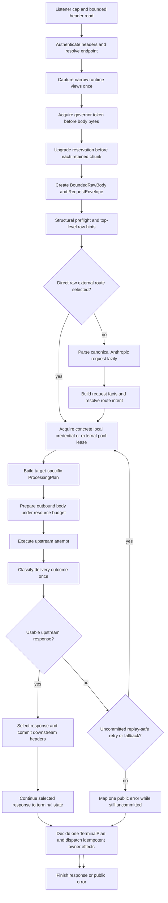
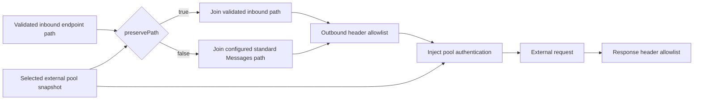
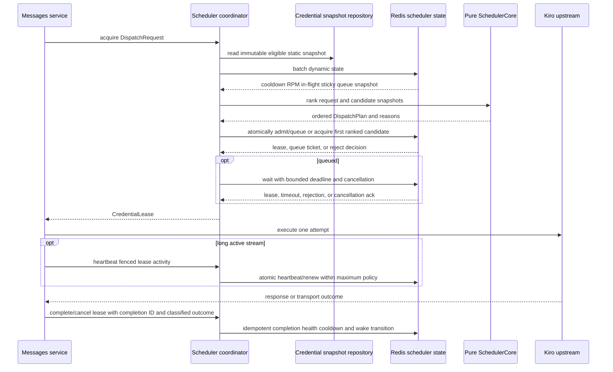
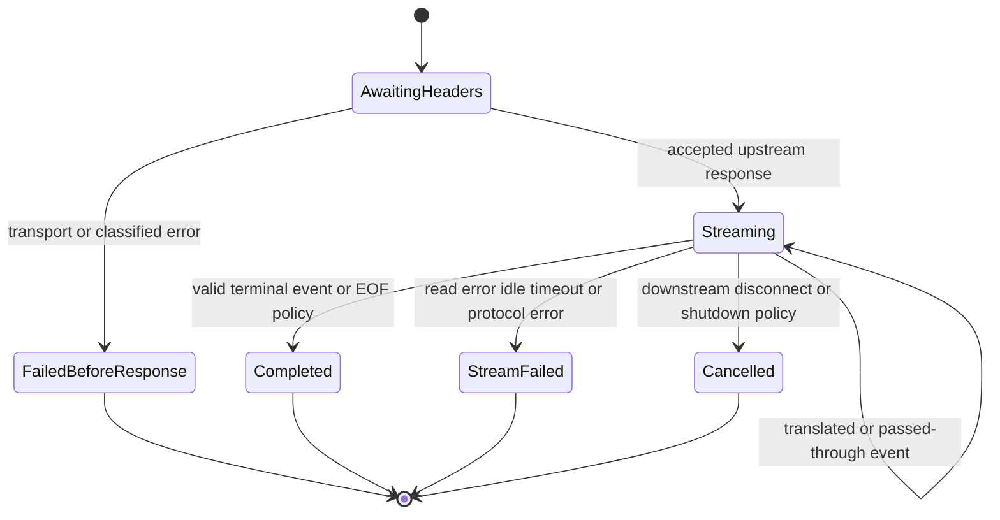
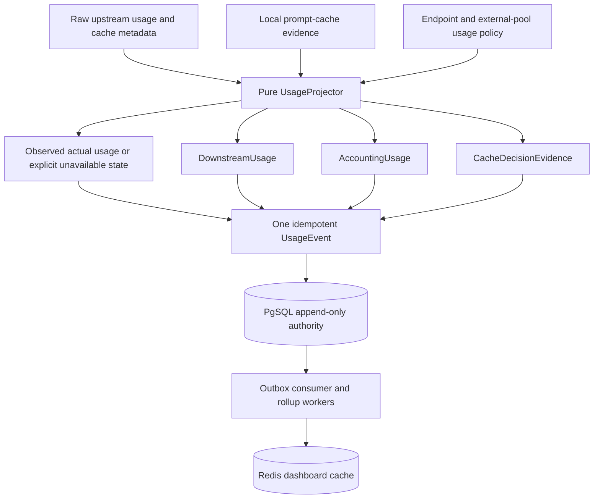
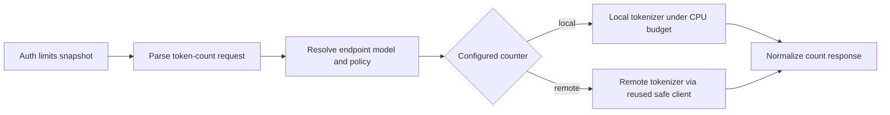
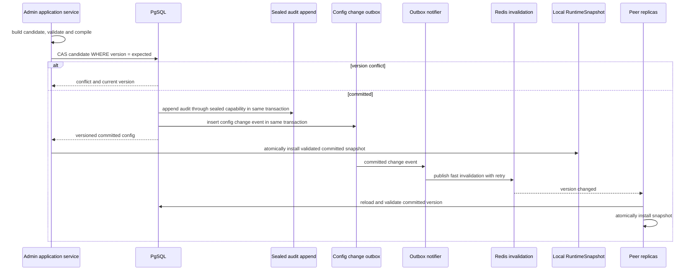
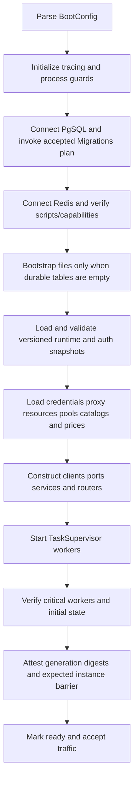
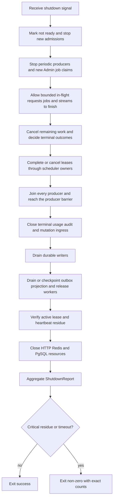

# Runtime Control And Data Flows

Role: Accepted end-to-end target runtime and control-flow specification

Status: Accepted; implementation Not Started

Authority: Defines binding target sequencing, technical-authority handoffs and failure behavior under decisions 003-014; it does not describe current implementation

As of: `v0.0.102` / `e9479df` / updated 2026-07-12

Read when: Changing Messages, streaming, count-tokens, Files, local or external routing, scheduler attempts, usage/cache handling, runtime updates, startup, readiness, or shutdown

Related: [Target architecture](target-system-architecture.md), [Module contracts](module-boundaries-and-contracts.md), [State ownership](state-ownership-and-consistency.md), [Accepted decisions](../../decisions/README.md), [Current runtime flows](../../../../baseline/runtime-flows.md), [Request-body plan](../../../request-body-capability-modularization/README.md)

## Authority Notice

Decisions 003-014 accept these target flows and the one-program delivery model. They distinguish required ordering from internal implementation detail. Current handlers/managers may differ; source and baseline remain authoritative for current behavior until the complete target is activated.

All flows operate in one operator trust domain. Request API keys authenticate callers but do not create user or tenant contexts.

## Common Request Context

Every data-plane request obtains:

- a globally unique request ID;
- an `EndpointProfile` derived from the validated route;
- one authenticated Request API Key version for audit only;
- one immutable `BoundedRawBody` tied to a scoped `MOD-RESOURCE-GOVERNOR` admission handle;
- one versioned immutable `CapturedRuntime` narrow-view bundle; the raw complete snapshot remains inside `MOD-RUNTIME-CONFIG`;
- stage-specific timeout budgets;
- scoped request resource-budget handles; mutable permit state remains only in `MOD-RESOURCE-GOVERNOR`;
- a cancellation signal linked to downstream disconnect and process shutdown.

The request never replaces that bundle or reads the runtime provider again mid-flight. Attempt records, diagnostics, and usage include the captured version without including secrets.

Body-bearing Admin requests follow the same pre-byte governor ordering with the decision-011 8-MiB Admin request sublimit. They use Admin authentication and control-plane application contracts, but they do not own a second admission ledger or borrow the eight reserved health/control slots.

## Endpoint Profiles

Transport maps paths to profiles before application logic:

| Path family | Target semantic |
| --- | --- |
| `/v1` | default high-cache policy and standard Anthropic response profile |
| `/cc/v1` | Claude Code stream profile with correct final usage |
| `/ha/v1` | high-cache profile with its own usage-policy override |
| `/na/v1` | no local cache simulation and raw usage policy unless explicitly configured otherwise |
| `/dfcache/{route}/v1` | a declared named cache/usage policy; unknown names are rejected |

An endpoint profile selects policy identifiers. It does not duplicate a full application state object per route.

## Messages Flow



### Ingress

1. Public transport acquires the one-governor connection handle on accept and a stream handle before reading that HTTP/1 request or opening that HTTP/2 stream. Only within decision-011 listener/stream capacity does it read at most 128/32-KiB headers within 10 seconds, authenticate from headers and validate the declared route. Slowloris, idle keepalive and excess HTTP/2 streams consume only their bounded protocol slots; eight health/control slots remain reserved.
2. Through `PUBLIC(MOD-RUNTIME-CONFIG)`, transport calls `capture()` exactly once and receives a `CapturedRuntime` bundle containing only versioned narrow views; the raw complete configuration never leaves the runtime-config owner.
3. Before reading, allocating or retaining any body byte, transport acquires the base/body token from `MOD-RESOURCE-GOVERNOR`. `Content-Length` is an early reservation/rejection hint. A missing-length or chunked body upgrades the same reservation before each chunk allocation/retention and stops immediately when the 50-MiB, idle/total-read or weighted budget cannot be granted.
4. Only after bounded collection does transport create `BoundedRawBody` and `RequestEnvelope`. The opaque admission handle stays live for the request and is the only path to stage upgrades; no downstream module mirrors permit state or creates another global semaphore.
5. A bounded structural preflight enforces accepted depth, message/content/tool/schema node, edge, property and string cardinality before unbounded deserialization/traversal. Cancellation and a failed limit release scoped work without retaining a partial ungoverned body.
6. Transport passes the envelope and captured bundle to `MOD-MESSAGES`. A lightweight top-level probe extracts only facts needed for early policy: model, stream, and other explicitly supported top-level hints.
7. The probe never downloads media, normalizes tools, counts tokens, mutates body bytes, or writes diagnostics.

### Early Raw Direct

If direct-routing policy can decide from endpoint and raw hints, and a matching raw external pool is available, the request may select that target before full parse. The selected target then receives an external-raw processing plan.

If policy requires canonical fields or a normalized/local target, the application lazily parses the body once. Parse failure is a client error and cannot be hidden by an unrelated fallback unless an accepted raw-direct contract explicitly allowed the request to bypass parse.

### Route And Target Selection

Routing is a two-stage decision:

1. `RoutePlanner` chooses local preferred, external direct, or a permitted fallback intent.
2. The appropriate coordinator acquires a concrete credential or external pool lease atomically.

The availability input is a batched scheduler snapshot, not a long-lived `local_available` boolean. Model eligibility, enabled state, cooldown, RPM, concurrency, exclusions, warmup, proxy validity, and queue limits remain explicit facts.

Target selection precedes target-specific body processing. A local preflight failure that qualifies for external raw fallback must not first pay for Kiro conversion, remote media materialization, token counting, or payload shaping.

### Target-Specific Preparation

#### Local Kiro

```text
canonical Anthropic request
-> missing max_tokens policy
-> thinking trigger and compatibility policy
-> budgeted file/remote source materialization
-> local model resolution
-> Anthropic-to-Kiro conversion
-> tool/schema/pairing compatibility stages
-> protocol repair and configured payload shaping
-> final serialization for the current payload revision
-> Kiro upstream adapter
```

The current request-body capability modules remain the characterization source for compatibility defaults while the target-only candidate is built. The target plan changes orchestration and authority, not behavior by assumption.

#### External Normalized

```text
canonical Anthropic request
-> pool capability and model eligibility
-> pool-specific model mapping
-> configured media and thinking normalization
-> optional external payload guard
-> final serialization for the current payload revision
-> external upstream adapter
```

Only the selected pool's capabilities and configuration enable stages. A retry to another pool rebuilds the plan for that concrete pool.

#### External Raw

```text
raw request Bytes
-> optional top-level model probe or top-level rewrite
-> no other body mutation
-> preserve-path URL resolution
-> external upstream adapter
```

Raw mode does not imply usage pass-through. If usage projection is enabled and facts are available, projection may run independently. If standard facts cannot be obtained without violating raw semantics, the usage plan records an explicit projection fallback rather than mutating the body.

## External Path And Header Flow



Path joining uses parsed URLs and canonical paths, never string concatenation. Query handling is explicit. Client `Authorization`, `x-api-key`, `Cookie`, `Host`, and hop-by-hop headers are removed; pool authentication is injected by the adapter. `Set-Cookie` and hop-by-hop response headers are not forwarded.

`preservePath=true` must preserve `/cc`, `/ha`, `/na`, and declared `/dfcache` request paths according to an accepted URL-join contract. `preservePath=false` uses the pool's standard Messages endpoint. No configuration field may be persisted and exposed in UI while being silently ignored.

## Scheduler Flow



### Scheduler Rules

- Pure ranking performs no I/O and acquires no locks.
- Dynamic Redis state is fetched in a bounded batch, not one round trip per candidate.
- Capacity, RPM, cooldown, global limits, per-credential limits, and acquisition are one logical atomic transition.
- Sticky candidates pass the same hard eligibility checks as other candidates.
- A bounded queue has explicit admission, maximum wait, cancellation, and wake behavior.
- Queue cancellation races atomically with grant; a cancelled or timed-out ticket cannot receive a late lease.
- One attempt excludes already-tried credentials or pools according to the retry plan.
- Lease heartbeat and completion use an ownership/fencing token; stale owners cannot renew or complete a newer lease.
- A stable completion ID makes duplicate complete/cancel calls return the original result without applying effects twice.
- Stream leases remain held until upstream terminal state or downstream disconnect.
- Redis failure does not silently fail open.

External pools use an equivalent coordinator with external-pool-specific eligibility, capacity, cooldown, automatic disable, and retry rules. They do not enter local credential refresh or local account state.

## Attempt, Retry, And Failure Flow

The upstream adapter returns transport facts. One error classifier maps them to a typed outcome containing failure class, upstream execution possibility, upstream response progress, replay safety, status, retry-after, and scheduler effect. Upstream response progress does not prove replay safety: an upstream may have executed or billed a POST before returning an error.

The application may retry or fallback only when all are true:

1. downstream commitment is still `Uncommitted`; handing response headers to transport is already a commitment even when no body/SSE byte has been emitted;
2. the bounded attempt/time budget remains;
3. replay safety is `SafeWithoutIdempotency`, or the selected target provides an effective idempotency mechanism that covers the same logical request;
4. the route policy permits that target transition;
5. another eligible target can be acquired.

Any request whose bytes may have reached the upstream, without a target-specific proof that execution was rejected before work, is ambiguous. External POST retry is disabled by default for this state unless the selected upstream has an effective idempotency contract. Caller-validation errors do not punish credentials and do not trigger unrelated fallback. Authentication, rate-limit, quota, network, server, protocol, stream, cancellation, and risk-control outcomes retain distinct scheduler effects.

A normalized payload-too-long rescue produces one new `PayloadRevision`, recalculates derived artifacts, and can run only within its explicit retry plan. It cannot send a shaped normalized body to a raw pool.

## Streaming Flow



The diagram is the response-session state machine, not request terminal authority. `MOD-RESPONSE` owns SSE ordering, bounded buffering, downstream commitment/backpressure, response-session state, and emission of the final wire usage supplied by the usage owner. It emits one stable neutral terminal-facts record; it does not persist terminal effects or release scheduler capacity directly. Once `Streaming` starts, failover is prohibited. A stream error contributes neutral facts, `MOD-TERMINAL-LIFECYCLE` reduces them once, and the scheduler owner applies idempotent complete/cancel/release through its public port while the existing downstream stream terminates without splicing another upstream response.

Timeouts are runtime-stage-specific: body read, queue wait, media fetch, connect, first byte, stream idle and optional total duration. Slow first byte or long progressing execution can be valid; expected model latency is not a stuck connection. Queue/lease values follow decision 010; other exact profile values remain bounded runtime configuration verified by evidence.

## Usage And Cache Flow



The projector keeps four meanings separate:

- actual upstream usage;
- usage reported to the downstream client;
- accounting/cost usage;
- cache simulation and adjustment evidence.

If a policy reduces reported input and moves the difference into cache read or cache creation, the operation is one pure, versioned formula. The event records values before and after projection, the moved delta, capping/jitter decisions, and the policy identifier. It is invalid for input to be reduced under a move-to-cache policy while both cache read and cache creation remain unchanged without an explicit, recorded reason.

The request submits one terminal event with a stable event ID. PgSQL is authoritative. Dashboard rollups and Redis summaries are derived asynchronously. Redis event dedupe and all aggregates occur in one atomic script; a dedupe marker can never commit independently of its aggregate update.

TTFB never waits for rollup queries or dashboard cache writes. Decisions 004/010 require the minimal terminal envelope and typed required obligations to be durably accepted before a clean downstream terminal completion; derived rollups remain asynchronous. Backlog, rejection, retry, shutdown and residue semantics follow the accepted writer/terminal contract and cannot be weakened by a runtime mode.

## Count-Tokens Flow



Token counting is a distinct use case. It does not acquire a Kiro credential lease or enter Messages retry logic. Remote or blocking counters use their own concurrency, byte, queue, and timeout budgets. Client construction and body cloning are not request-local side effects when reuse is possible.

## Files Flow

Files use a `FileObjectStore` contract rather than direct access to an in-memory map:

1. transport receives the upload only through the pre-byte governor path, incrementally enforces multipart/body size and validates bounded media metadata;
2. the Files application service reserves count/byte capacity;
3. the store writes atomically and returns an unguessable file ID;
4. list uses a stable paginated order and reads bounded metadata without scanning historical delete tombstones;
5. metadata and content/get use the same object authority;
6. Messages materialization reads through the same store under request resource budget;
7. delete is idempotent and releases payload plus ordering/index metadata;
8. a supervised retention worker enforces count, byte, metadata, and age bounds;
9. readiness and metrics expose sustained safety pressure without treating ordinary momentary capacity use as process failure.

Because the product is one trust domain, Files are not assigned to users or tenants. Restart durability and storage backend are explicit deployment choices; neither may remain accidental behavior.

## Runtime Configuration Flow



The sealed audit append and config-change outbox are two distinct writes in the owning transaction. The outbox drives external notification only and can never replace the mandatory audit fact. Redis invalidation is an acceleration path, not durable authority. Peers periodically compare versions to recover from missed notifications. A request already in progress remains on its captured version.

Security-sensitive Admin key rotation uses decision 010's PgSQL auth epoch as authority, Redis invalidation as acceleration, at-most-5-second durable polling and revalidation of any Admin mutation whose snapshot is older than 2 seconds. A replica that cannot prove the current epoch rejects mutation and becomes degraded/unready for that profile; no grace mode permits indefinite old-key acceptance.

## Credential Refresh And Runtime Mutation Flow

1. A refresh coordinator obtains the per-credential Redis refresh lease.
2. It reads a versioned credential snapshot.
3. It calls the auth upstream through the credential network adapter.
4. It commits the new token using an expected refresh generation.
5. A conflict discards or reconciles the stale result; it never overwrites a newer token.
6. A committed row change emits an invalidation event.
7. Scheduler/account snapshots reload without replacing unrelated credentials.

Success counters and other commutative statistics use atomic deltas or append events. They do not clone and save the complete credential list or runtime-state table.

## Startup Flow



`MOD-BOOTSTRAP` owns prerequisites, manifest order, public-contract invocation and readiness gating. `MOD-MIGRATIONS` owns common protocol/runner/ledger mechanics; each state authority owns immutable manifest instances/SQL/DDL; `MOD-RECOVERY` separately owns backup/restore/Redis rebuild/forward recovery. Fresh/legacy adoption, partial state, checksum drift and concurrent startup follow [decision 008](../../decisions/008-domain-owned-migrations-and-recoverable-adoption.md); decision 014 requires every expected instance to attest the same generation/digests before traffic opens. Blocked/unknown migration, missing membership or mixed generation never reaches ready.

File configuration is bootstrap input, not an overwrite source once durable data exists. Existing credentials, proxy resources, external pools, runtime config, and secrets are never reconstructed from an incomplete process snapshot.

## Readiness Flow

Liveness answers whether the process event loop is alive. Readiness answers whether new work can be accepted safely. Target readiness considers:

- a valid runtime/auth snapshot is installed;
- required scheduler coordination is available;
- critical supervised workers are running;
- durable-write backlog remains within the accepted bound;
- resource governors are healthy and no sustained safety-budget breach prevents safe service;
- this instance and every expected peer attest the exact decision-014 release generation, digests and membership barrier;
- shutdown has not started.

Ordinary momentary semaphore or request-queue saturation is a request-level overload response, not a readiness failure; otherwise load balancers can amplify a burst by removing healthy replicas. Decisions 010/011/014 make readiness fail closed for an invalid memory/pool/key profile, loss of required PgSQL/Redis correctness, mixed/missing release-generation membership, critical durable acceptance failure, writer hard-ceiling breach, permit-accounting corruption, or resource non-recovery beyond 60 seconds. A rebuildable projection may remain ready only with a checkpoint no older than 5 minutes and explicit degraded health. Implementations may choose stricter lower thresholds, not defer these boundaries to another architecture decision. Deployment health checks call application readiness, not TCP-only probes.

## Shutdown Flow



Shutdown is supervised and producer-aware. Stopping a producer from accepting work is distinct from stopping the consumer/reconciliation worker that drains accepted work. Closing admission does not close writer inputs needed by accepted requests/jobs. In-flight work reaches terminal state or cancellation; only after every producer joins and its barrier reaches zero are writer inputs closed/drained. PgSQL remains available through durable checkpointing and Redis through lease reconciliation/residue reporting. Dropping a sender is not drain. Accepted/finished/abandoned/release-failure/panic/deadline facts appear in the report. Critical usage, audit, mutation, terminal or lease residue requires non-zero exit under decisions 006/010; the 120-second segmented deadline policy is binding.

## Flow-Level Observability

Every request trace records bounded, non-secret facts:

- endpoint profile and runtime version;
- route intent and concrete target kind;
- processing-plan stages executed or skipped;
- queue, media, transform, connect, first-byte, stream, and total timings;
- candidate count, attempts, retry decisions, and terminal failure class;
- resource permits, bytes, and rejection reason;
- usage policy and projection outcome;
- terminal writer acknowledgement status.

Metrics use bounded labels. Request IDs, raw models, credential labels, paths containing arbitrary route names, prompts, tools, images, keys, tokens, and error bodies are not metric labels.

## Flow Acceptance Conditions

- External raw direct can complete without full parse or target-unrelated heavy work.
- Target-specific processing never runs before a concrete target is selected.
- Scheduler dynamic state uses bounded batch I/O and atomic acquisition.
- No retry or fallback occurs after downstream commitment leaves `Uncommitted`, including after status/headers are irrevocably handed to transport with zero body bytes, or under an unapproved ambiguous-delivery state.
- Slow first-byte and long total execution are controlled by phase policies rather than one accidental total timeout.
- Usage input/cache transformations are reproducible from recorded evidence.
- Config concurrent changes conflict explicitly instead of losing an update.
- Files, remote media, token counting, queues, and streams respect cancellation and resource budgets.
- Readiness represents application ability, and shutdown residue changes the process outcome.
