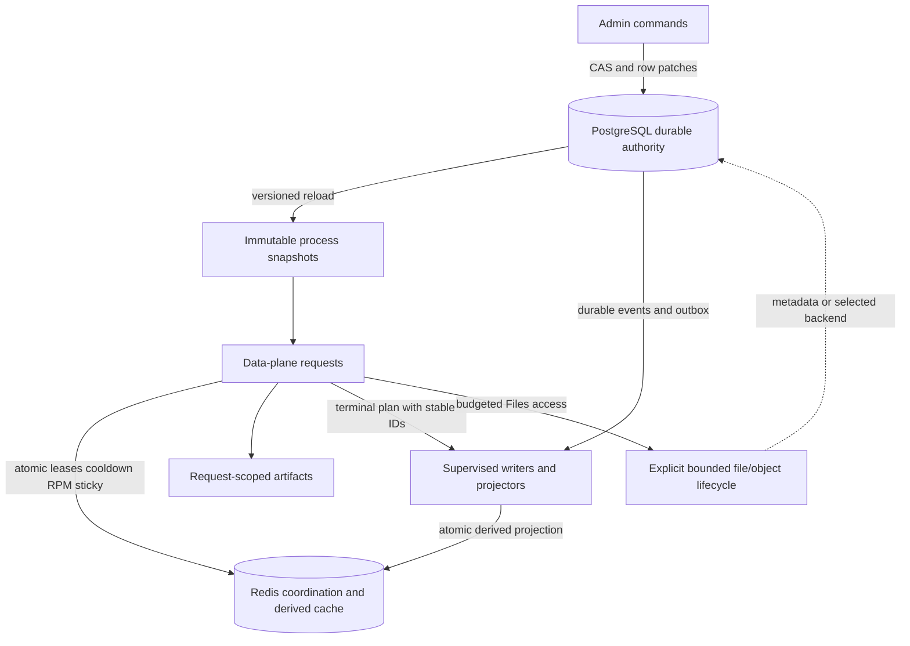
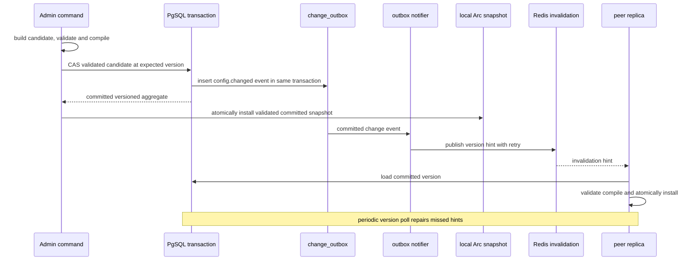
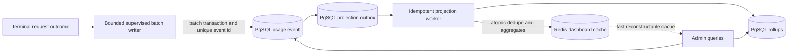

# State Ownership And Consistency

Role: Accepted state authority, consistency, and durability contract

Status: Accepted; implementation Not Started

Authority: Defines binding authorities, mutation rules, CAS, outbox, replay and failure semantics under decisions 004-014; it does not describe an already implemented state model

As of: `v0.0.102` / `e9479df` / updated 2026-07-12

Read when: Changing runtime config, credentials, external pools, scheduler state, usage, cache, audit, jobs, Files, diagnostics, replica reload, startup, or shutdown durability

Related: [Target architecture](target-system-architecture.md), [Module contracts](module-boundaries-and-contracts.md), [Runtime flows](runtime-control-and-data-flows.md), [Accepted decisions](../../decisions/README.md), [Decision 008](../../decisions/008-domain-owned-migrations-and-recoverable-adoption.md), [Decision 010](../../decisions/010-fixed-operational-and-acceptance-policies.md), [Current storage baseline](../../../../baseline/storage-and-state.md), [Migration finding](../problems/operations-testing-frontend-and-supply-chain.md#ops-005-startup-migration-has-mutable-non-atomic-inline-progress), [Problem catalog](../problems/README.md), [Authority map](../../indexes/authority-and-source-map.md)

## Authority Notice

Decisions 004-014 bind this target state model. It does not claim that current PgSQL, Redis, in-memory managers, Files, usage writers or diagnostics satisfy it. Exact internal schema/type names remain implementation details, while TTLs, capacities, acknowledgement and recovery behavior follow decisions 010/011/014 and measured evidence.

The model is global to one operator and one trust domain. There are no tenant partitions, tenant IDs, per-user rows, tenant caches, tenant file ownership, or tenant consistency guarantees.

## Core Rule

Every state has exactly one authority. Other copies are snapshots, indexes, caches, queues, or projections with explicit reconstruction and staleness rules. A process-local object is never a durable authority merely because it currently contains a complete copy.



## Ownership Matrix

| State | Authority | Process memory | Redis | Filesystem/object storage |
| --- | --- | --- | --- | --- |
| boot-only connection/listener settings | deployment input | parsed immutable boot config | none | optional config source |
| runtime routing/scheduler/payload/usage policy | PgSQL versioned aggregate | immutable compiled snapshot | invalidation acceleration only | bootstrap only when durable row absent |
| Request API keys | PgSQL versioned auth aggregate | immutable hash/index snapshot | optional version/revocation acceleration | no runtime authority |
| Admin key and browser sessions | PgSQL versioned key/epoch authority | short-lived validation snapshot | bounded hashed session records with 15-minute idle/8-hour absolute TTL and revocation epoch | no browser durable-storage authority |
| Kiro credentials and secrets | PgSQL row per credential | immutable credential snapshot and reusable clients | no secret authority | bootstrap only when table empty |
| reusable proxy resources and secrets | PgSQL versioned proxy-resource aggregate owned by `MOD-PROXY-RESOURCES` | immutable redacted catalog plus bounded resolved transport facts; no second catalog authority | invalidation acceleration only; no secret authority | none |
| credential token generation | PgSQL CAS row | applied snapshot | refresh lock only | none |
| credential counters/statistics | PgSQL atomic deltas or durable events | bounded display cache | optional derived windows | none |
| external pool configuration/manual state | PgSQL row per pool | immutable pool snapshot | no secret authority | none |
| model capabilities and pricing | PgSQL catalog/version | immutable catalog snapshot | invalidation acceleration | bootstrap/reference only |
| lease, queue, RPM, cooldown, sticky, probation, refresh lock | Redis atomic state | narrow active-lease registry and read snapshot | authority for the active TTL window | none |
| request terminal plan/journal | PgSQL append-only event/outbox according to accepted acknowledgement policy | request-local one-winner state and bounded pending acknowledgements | no terminal authority; lease completion remains Redis coordination | no implicit spool |
| usage/accounting event | PgSQL append-only event | bounded pending queue | derived dashboard/cache only | no implicit spool |
| usage rollups and dashboards | reconstructable PgSQL projection; Redis cache | bounded query cache | derived, atomically updated, expiring | none |
| audit event | PgSQL append-only event/outbox | bounded pending queue | optional invalidation | no default body log |
| cleanup or maintenance job | PgSQL durable job row and lease | local executing handle | optional wake signal | output only if explicitly defined |
| domain schema and migration definitions | each state-owning `MOD-*` module owns immutable ordered manifest instances, SQL/DDL, probes and backfill handoff | registered read-only manifests only | none | versioned source artifact, never mutable startup input |
| migration active run, applied/adopted identity and step checkpoint | `MOD-MIGRATIONS` owns common ledger semantics and its port; PgSQL is the durable adapter | bounded runner/inspection state; bootstrap sees status only | none | no authority |
| recovery run/checkpoint | `MOD-RECOVERY` coordinates backup/restore/rebuild through public authority contracts | bounded recovery-run state | Redis epoch/rebuild status only | versioned runbook/evidence, not business authority |
| prompt-cache tracker | `MOD-PROMPT-CACHE` bounded versioned Redis evidence state; actual/derived/simulated labels remain distinct | bounded request-local snapshot/cache | shared TTL/capacity authority for evidence transitions | none |
| uploaded Files data | `MOD-FILES` shared bounded PgSQL `FileObjectStore` | bounded derived index/cache only | optional invalidation hint | no process-local production authority |
| debug body capture | no business authority | recorder config and counters | none | explicitly enabled bounded diagnostic directory |
| request parsed/transformed artifacts | request scope | sole owner until request ends | none | no implicit spill |
| process admission, weighted live-byte budget, combined wait ceiling and outbound connection permits | `MOD-RESOURCE-GOVERNOR` process-local authority | one mutable ledger; other modules retain only opaque scoped handles | none | no authority or spill |

Decision 010 fixes prompt-cache and Files cross-replica/restart authority. Process-local variants are development-only and cannot silently become production defaults.

## Runtime Configuration

### Aggregate Shape

The runtime snapshot is a versioned bundle of immutable sub-policies:

```rust
pub struct Versioned<T> {
    pub version: Version,
    pub updated_at: DateTime<Utc>,
    pub value: T,
}

pub struct RuntimeSnapshot {
    pub version: ConfigVersion,
    pub routing: Arc<RoutingPolicy>,
    pub scheduler: Arc<SchedulerPolicy>,
    pub payload: Arc<PayloadPolicy>,
    pub usage: Arc<UsagePolicy>,
    pub resources: Arc<ResourcePolicy>,
    pub external: Arc<ExternalRoutingPolicy>,
}
```

An implementation may initially retain one JSON aggregate in PgSQL, but every update is a typed field patch with `expected_version`. A later schema split must preserve atomic updates that truly span multiple policies.

### Compare-And-Swap

```sql
UPDATE runtime_config
SET data = apply_typed_patch(data, $patch),
    version = version + 1,
    updated_at = now()
WHERE id = 'default'
  AND version = $expected_version
RETURNING data, version, updated_at;
```

The actual implementation need not use a database function, but it must have equivalent semantics:

- one version is read and returned to the Admin client;
- the patch applies only if that version is still current;
- zero updated rows means conflict, not success;
- conflict returns the current version and a stable `409` contract;
- validation occurs before commit and the compiled snapshot is validated before publication;
- unrelated auth keys, credentials, external pools, catalogs, and pricing are not rewritten.

Cloning a full config, releasing an in-process lock, writing the clone, and replacing memory is not an accepted mutation algorithm.

### Reload And Replica Consistency



Redis notification is not the source of truth. An outbox consumer retries notification, and each replica polls durable version periodically. Replicas expose their applied version so lag is measurable. Requests already holding an old snapshot complete consistently on that snapshot.

If a committed configuration cannot compile on a replica, that replica keeps the last valid snapshot, becomes degraded or not ready according to an accepted policy, and emits a bounded high-severity event. It must not install a partially valid snapshot.

## Authentication State

Request and Admin keys are separate aggregates. Stored keys should use a one-way verifier where plaintext recovery is unnecessary; secret-bearing values use redacted types and never derive a revealing `Debug` representation.

Request API keys remain global credentials. Their identifiers may be recorded for rotation/audit but never become user ownership or routing partitions.

Admin traffic is low volume, so rotation correctness takes priority over a zero-I/O hot path. PgSQL auth epoch is authoritative; Redis accelerates invalidation, replicas poll at most every 5 seconds, and an Admin mutation with a snapshot older than 2 seconds revalidates or fails closed under decision 010.

## Credential State

Each credential is independently versioned. Mutations are narrow commands:

- add credential;
- patch authentication fields;
- patch enabled/manual-disabled state;
- patch priority, region, proxy, RPM, concurrency, supported models, or warmup policy;
- commit refreshed token with expected refresh generation;
- add a commutative statistics delta;
- soft-delete one explicit credential ID.

No command submits the complete active credential collection. Missing IDs never imply deletion. A token refresh cannot overwrite a newer token:

```rust
pub enum RefreshCommit {
    Applied(Versioned<CredentialToken>),
    StaleGeneration { current: RefreshGeneration },
}
```

Redis owns the short refresh lock; PgSQL CAS owns the durable winner. Losing the lock, lease expiry, process pause, or duplicate refresh therefore cannot silently commit stale state.

Manual disabled state is durable intent. Cooldown, rate-limit pacing, in-flight lease, and short probation are Redis runtime state. Automatic permanent disable requires a typed durable event/row update and remains distinct from manual disable.

## Proxy Resource State

`MOD-PROXY-RESOURCES` owns reusable proxy-resource identity, versioned CRUD, enabled state, endpoint/protocol validation, authentication-secret lifecycle, test behavior, immutable catalog publication and credential-binding resolution. A normal query returns redacted lifecycle metadata; it never returns a stored proxy password or a complete credential-bearing URL.

The credential owner stores only the selected proxy-resource ID and any explicitly supported direct per-credential proxy override. Runtime config may own a global default reference or policy, but neither `MOD-CREDENTIALS` nor `MOD-RUNTIME-CONFIG` owns a second reusable proxy catalog. The local scheduler consumes a narrow availability/binding view, and `MOD-KIRO-UPSTREAM` receives one bounded resolved transport fact for the captured catalog version. None can reload PgSQL proxy rows directly.

Create, patch, rotate, disable and delete use row-version conflict semantics. Secret patches use typed `Keep`, `Replace` or `Clear` intent. A durable referential guard rejects deletion while any credential remains bound; the operator first uses versioned `MOD-CREDENTIALS` rebind commands. `MOD-PROXY-RESOURCES` never reaches into the credential repository, and any future atomic rebind-and-delete workflow requires an explicit cross-owner transaction decision. A missing or disabled binding fails selection predictably rather than falling back to an unrelated secret.

Publishing a new version invalidates affected resolved bindings and emits a bounded non-secret retirement fact. Each consuming transport owner, including `MOD-KIRO-UPSTREAM`, retires its own proxy-keyed clients within the accepted client-cache bound; `MOD-PROXY-RESOURCES` never reaches into another module's client cache. Replica notification is only acceleration: periodic version reconciliation repairs missed events, and a replica that cannot prove an accepted catalog version exposes lag/degraded state rather than silently using an indefinite secret snapshot.

## External Pool State

External pools use row-level versions and patches equivalent to credentials. Secret-preserving update semantics are explicit: an omitted key means keep the existing key; an explicit replace operation changes it. Empty strings cannot accidentally erase a secret unless the public command explicitly defines clear semantics.

Manual `enabled`, automatic disable reason/time, supported models, URL, path policy, authentication, request body mode, mapping, limits, and projection policy have separate fields and mutation rules. Editing one pool never rewrites other pools.

`preservePath` is durable routing intent, not display metadata. A repository round-trip and E2E request test must prove that its stored value affects the selected outbound path.

## Process Resource Permit Authority

`MOD-RESOURCE-GOVERNOR` is the only mutable permit-state authority inside a process. It owns base request admission, weighted live-byte reservations and upgrades, the combined local/external process wait ceiling, outbound-connection permits and permit-recovery metrics. Its ledger is separate from Redis scheduler leases: process admission happens first, then a scoped admitted request may ask a scheduler owner for distributed capacity.

Public and Admin transports acquire the appropriate connection handle on accept and stream handle before header work. After bounded header authentication/profile resolution and one runtime capture, they acquire the base body handle before reading or retaining body bytes. `Content-Length` may reserve or reject early; chunked or missing-length bodies upgrade the same handle before each allocation. Health/readiness uses decision-011 reserved control capacity. Messages, Files, media, token counting, schedulers and upstream adapters may hold, upgrade and release only opaque scoped handles. Their semantic byte/count limits do not duplicate global permit counters, and no module can create an independent semaphore whose capacity bypasses this ledger.

The governor has no durable business authority and never selects a credential, route or target. A crash discards only that process's handles; decision-014 generation fencing and Redis scheduler recovery account separately for distributed leases. Permit cancellation, terminal release and 60-second resource recovery must reconcile admitted/current/released weight exactly; corruption or non-recovery has the fixed readiness consequence in decisions 010/011.

## Redis Coordination Model

Redis owns only short-lived coordination and reconstructable derived state. All operations that implement one logical transition are atomic Lua scripts or equivalent transactions.

Required atomic transitions include:

- global plus per-target lease acquisition, queue admission, and cancel-versus-grant;
- fenced lease heartbeat and idempotent complete/cancel by stable completion ID;
- monotonic cooldown/probation update;
- RPM window update and availability decision;
- sticky binding plus reverse index update/delete;
- refresh-lock acquire/renew/release with ownership token;
- usage event dedupe plus all associated dashboard aggregates;
- external-pool global/per-pool lease and cooldown changes.

The Redis adapter uses multiplexed/pool-safe access without a global mutex serializing unrelated commands. Script identifiers and key schema are versioned and observable.

### Lease Invariants

- Each lease has an unguessable ownership token, target, kind, acquired time, last activity, and TTL.
- Acquisition checks all relevant limits atomically.
- Queue state is `New -> Queued -> Acquired | Rejected | TimedOut | Cancelled`; a terminal ticket cannot receive a late grant.
- Lease state is `Active -> Completed | Cancelled | Expired`; completion is idempotent for the ownership/fencing token and stable completion ID.
- A stale ownership/fencing token cannot renew, release, or complete a newer lease.
- A later short cooldown cannot shorten an existing longer cooldown.
- A waiting request observes bounded queue and wait policies and can be cancelled.
- A stream renews or records activity every 15 seconds without extending beyond the decision-010 default 30-minute/explicit progressing-stream 2-hour maximum; TTL is 60 seconds and crash recovery only.
- TTL protects abandoned leases but is not the normal release path.

### Redis Failure And Restart

Redis coordination failure defaults to fail closed. Already-running upstream streams may continue using their local lease handles, but new acquisitions stop until coordination is safe.

The target maintains a narrow per-process active-lease registry. A Redis epoch change or data loss triggers decision 014's expected-instance/generation barrier. Each replica re-registers still-active leases; a missing instance is platform-fenced or reserves its full declared capacity until the absolute lease bound. Admission reopens only for proven remaining capacity. Fault-injection validation must pass `G-SCH`/`G-OPS` as implementation evidence for this fixed barrier.

Implicit local fallback that ignores shared limits is prohibited unless an explicit single-instance degradation decision defines detection, operator intent, limits, metrics, and recovery.

## Terminal Completion Authority

The request lifecycle selects one terminal cause in process and creates one immutable `TerminalPlan` with a stable `terminal_id` and stable child IDs for scheduler completion, credential outcome and usage. Duplicate callbacks return the existing plan. This is the only exactly-once claim at the request lifecycle boundary. `MOD-AUDIT` remains security/configuration audit authority and is not an implicit request-terminal child; any additional terminal effect requires an explicit decision and a new typed obligation rather than a generic effects collection.

Independent owners then converge:

1. `MOD-RESPONSE` owns downstream commitment and the response state machine; `MOD-TERMINAL-LIFECYCLE` owns the one-winner terminal reduction.
2. `MOD-TERMINAL-JOURNAL` owns the durable terminal/outbox journal and at-least-once replay envelope.
3. `MOD-SCHEDULER-LOCAL`/`MOD-SCHEDULER-EXTERNAL` own Redis queue/lease completion; `MOD-CREDENTIALS` owns durable credential-outcome application.
4. `MOD-USAGE` owns usage projection, usage-event persistence and derived rollups.
5. `MOD-SUPERVISOR` owns supervision, retry/reconciliation lifecycle, shutdown barriers and residue reporting through owner drain contracts.

Redis and PgSQL do not share a transaction. The system therefore does not claim atomic exactly-once completion across them. Each effect uses its stable child ID and an idempotent owner operation. A crash or timeout may leave a plan partially applied, but recovery can distinguish each effect as pending, acknowledged, duplicate, failed, or abandoned.

Lease completion uses the scheduler fast path and a supervised pending-release registry. A failure remains visible and is retried within a bound; TTL is the final recovery layer. Lease completion success does not imply usage or credential persistence success, and the reverse is also true.

The minimal durable terminal append must acknowledge before clean downstream completion under decision 010. Derived rollups and Redis dashboards never block the client. If downstream output already committed and required append cannot succeed, the service records critical residue, becomes unready, retries during shutdown/recovery and cannot report a clean process exit while residue remains.

## Usage Event Authority

Usage is modeled as an immutable effect derived from the accepted terminal plan, with a stable `event_id` and `request_id`. It separates:

- actual upstream usage;
- downstream reported usage;
- accounting and estimated cost;
- cache simulation/projection evidence;
- local credential and external pool attempt chains;
- route, status, latency, error, and configuration version.

PgSQL enforces uniqueness on `event_id`. Replaying the same event is success without double accounting. Mutable dashboard records are not the authority.



The writer may batch multiple request acknowledgements and resolves each only after the transaction result is known. Decisions 004/010 fix the acknowledgement point: the minimal terminal envelope and required typed usage/credential obligations are durably accepted in PgSQL before a clean downstream terminal completion is acknowledged. Scheduler completion remains a separate immediate idempotent Redis path, and dashboard/cache projections remain asynchronous/rebuildable. The implementation must enforce:

- no clean completion before durable append acceptance;
- at most 1,024 records and 16 MiB for this critical writer ingress, while all critical writer ingresses together stay at or below 4,096 records and 64 MiB;
- retry and backoff;
- full-ingress or PgSQL-unavailable behavior that either completes the required durable accept synchronously within its operation deadline or returns the fixed failure/becomes unready; accepted work is never dropped;
- the decision-010 30-second required durable-writer shutdown drain after every producer has joined or been explicitly accounted;
- any abandoned required event is critical residue and forces a non-zero exit; only an explicitly rebuildable derived projection may coalesce/drop under its bounded metric and replay policy.

Only decision 011's bounded synchronous durable-accept path may be used when a critical ingress is saturated. No design may invent another per-record PgSQL/Redis fallback from an overloaded async request path or bypass the fixed operation deadline and overload contract.

## Usage Projection And Cache Consistency

The projection formula is pure and versioned by policy ID. Its result includes original values and each adjustment. Required invariants include:

- token fields remain non-negative and within type bounds;
- actual upstream values are not overwritten by downstream reporting policy;
- cache read/write simulation is independent from raw versus normalized external body mode;
- a configured move of reduced input into cache records the corresponding delta or a typed suppression reason;
- final caps only reduce the field they govern and record the reduction;
- retries and duplicate terminal callbacks cannot commit prompt-cache success twice;
- `/na` bypass semantics and `/v1`, `/cc`, `/ha`, `/dfcache` overrides remain distinguishable.

Redis application uses one script:

```text
if event id already seen:
    return duplicate
else:
    update every required aggregate
    store dedupe marker with the projection lifecycle
    return applied
```

The marker and aggregates either all commit or none commit. If Redis projection fails, the durable outbox remains retryable. Redis expiry or loss is repaired from PgSQL events/rollups.

## Audit And Admin Job State

Every security- or configuration-significant Admin command invokes the sealed `MOD-AUDIT` append capability inside the same PgSQL transaction as the durable change. A domain change/job/notification outbox row may be written additionally in that transaction, but it never substitutes for the audit append. Actor identity is the authenticated global Admin credential/version or explicit automation identity; it is not a tenant/user model.

Long-running cleanup, sync, and maintenance operations use durable job rows:

- job ID and type;
- requested parameters and configuration version;
- queued/running/succeeded/failed/cancelled state;
- lease owner and expiry;
- progress and bounded error summary;
- requested, started, updated, and completed times.

Workers claim jobs through a database lease or `FOR UPDATE SKIP LOCKED`. A restart or another replica can resume or mark stale work. Query and cancellation do not depend on the process that accepted the Admin request.

## In-Memory State

Allowed long-lived memory:

- immutable runtime, auth, credential, pool, model, and pricing snapshots;
- reusable HTTP clients keyed by bounded network configuration;
- bounded prompt-cache or query caches with explicit weight/TTL;
- active local lease registry needed for release and Redis restart recovery;
- bounded writer channels and progress counters;
- supervised task handles;
- bounded File index for the selected store.

Request-local memory owns raw bytes, parsed representation, payload revisions, prepared outbound bytes, stream state, and attempt history. It is released when the request terminates.

Forbidden memory authority:

- a mutable complete credential vector used as the source of durable overwrites;
- a complete runtime config clone modified outside a CAS transaction;
- per-process cleanup job truth;
- unbounded usage/log/file caches;
- local-only concurrency/cooldown state presented as cluster truth;
- a hidden fallback queue with no capacity, age, or drain metrics.

No broad lock is held across network, database, Redis, file, or sleep awaits. Snapshot replacement is atomic; narrow mutable registries are sharded or separately locked by responsibility.

## Filesystem And File Objects

The filesystem has no implicit business authority. It may hold:

- read-only embedded/static assets;
- deployment/bootstrap config;
- an accepted `FileObjectStore` implementation;
- explicitly enabled bounded diagnostics;
- operator-requested exports with explicit paths and lifecycle.

Each writable root defines owner, purpose, permissions, symlink policy, file count, total bytes, per-file bytes, age, startup scan, cleanup, crash behavior, and whether it is versioned evidence or disposable output.

Debug body capture is disabled by default. If enabled, it uses safe create semantics, restrictive permissions, an allowlist/redaction policy, maximum directory bytes, maximum files, maximum age, and an automatic stop/drop outcome. File rolling without total retention is not bounded lifecycle management.

The Files API uses unguessable IDs and path-safe lookup. In a single trust domain, any authenticated request may be allowed to reference an existing file according to the accepted API contract; that is not tenant authorization. Capacity, restart loss, expiry, and storage failure remain explicit user-visible semantics.

## Failure Matrix

| Failure | New data-plane work | Existing work | Control plane | Required consistency action |
| --- | --- | --- | --- | --- |
| PgSQL unavailable | stop new admission when terminal durable acceptance cannot be proven; last valid read snapshots do not waive that rule | existing requests may finish only with the fixed terminal outcome/residue behavior | durable mutations reject | become unready; keep the critical writer within 1,024 records/16 MiB and never exceed the 4,096-record/64-MiB aggregate ceiling |
| Redis unavailable | no new coordinated lease by default | already leased work may finish | coordination commands reject | fail closed; recover through epoch/barrier |
| terminal journal append fails | stop new admission when the bounded synchronous accept cannot complete or the critical ingress reaches its hard ceiling | response follows commitment state; terminal plan remains pending | durable acceptance rejects | retry by stable ID; become unready; expose critical residue; no clean shutdown while required residue remains |
| lease completion fails | new admissions may be restricted by capacity/reconciliation policy | response need not be rewritten | scheduler status visible | supervised retry by fenced token/completion ID; TTL only final recovery |
| invalid new config committed or loaded | keep last valid snapshot | requests keep captured version | reject further activation and alert | do not partially install; expose version lag/error |
| config invalidation lost | unaffected on captured snapshot | unaffected | committed write remains valid | periodic version poll reloads |
| usage PgSQL append fails | admit only while the already durable obligation can remain inside fixed critical-ingress/readiness bounds | response follows the already accepted terminal obligation; no fabricated usage success | usage queries remain on durable history | bounded idempotent retry; hard-ceiling/readiness and shutdown-residue rules apply; no Redis-only authority |
| Redis usage projection fails | requests need not wait for dashboard | durable event remains | dashboard may be stale | outbox retry/rebuild; marker not committed alone |
| worker panic | admission/readiness depends on criticality | owned in-flight item has retry/recovery state | status visible | supervisor restarts or fails readiness; no silent detach |
| filesystem quota reached | body capture/File write rejected predictably | existing handles remain valid | status visible | no new files beyond quota; count drop/rejection |
| resource-governor accounting corrupt or not recovered within 60 seconds | reject new public/Admin work; reserved health/control remains available | cancel or finish only through existing scoped handles | mutations reject | become unready; no secondary semaphore or local fallback; restart/reconcile exact admitted/released weight |
| release-generation membership/digest mismatch | no traffic admission | already admitted work drains only under the fenced generation contract | mutation admission remains closed | decision-014 barrier stays closed until every expected instance attests and old/mismatched instances are fenced |
| process shutdown | stop new admission | bounded drain/cancel | mutations freeze | non-zero exit for critical abandoned work |

Decisions 010/011/014 fix degraded allowances, residue criticality, numeric resource policy and generation barriers. The table is required implementation behavior.

## Database Migration Rules

These accepted rules realize `QA-OPS-003` and target closure for `OPS-005`; current inline startup schema does not yet follow them.

- Each state-owning module owns immutable ordered checksummed manifest instances plus SQL/DDL, probes, compatibility notes and backfill handoff. Physical coexistence in one PgSQL database does not transfer schema authority to a shared store, Migrations, Recovery or bootstrap.
- `MOD-MIGRATIONS` owns the common manifest protocol/validation, dependency plan, fenced runner, transaction-or-resume mechanics, active/applied/adopted/checkpoint ledger and migration reconciliation. It owns no domain SQL/DDL, backup/restore or Redis rebuild.
- `MOD-RECOVERY` owns backup/restore verification, Redis rebuild/epoch, previous-binary and cross-authority forward-recovery orchestration. It owns no migration runner/ledger or domain state.
- `MOD-BOOTSTRAP` validates prerequisites, supplies manifests in dependency order, invokes the Migrations public contract, keeps readiness closed and reports the result. It owns no runner internals, domain DDL, delimiter parser, mutable checksum, checkpoint mutation or hidden backfill.
- Use immutable versioned migrations, not delimiter-based ad hoc schema execution. An applied `(module_id, version)` with a different checksum is a hard pre-mutation failure rather than an overwritten ledger row.
- Transactional DDL runs atomically where PostgreSQL permits it. A non-transactional operation declares its preconditions, fencing/advisory-lock behavior, durable step/checkpoint state, idempotent resume action, and terminal failure state before it can run.
- `R2.0.migration-foundation` self-bootstraps the minimum common ledger for a fresh database under one fence. It does not depend on the legacy inline runner to create its own authority.
- Adopting a current database requires a versioned legacy-to-owner map and catalog/constraint/index/legacy-row/owner-postcondition probes. The mutable `inline-schema` checksum or table existence alone cannot prove adoption; unknown, partial, corrupt or drifting state keeps readiness closed and requires an explicit resume or forward-reconcile path.
- Fresh, verified-legacy, partial/interrupted, corrupt/drift and concurrent-start paths are separate fixtures. One fenced runner mutates; other replicas inspect/wait or fail readiness within policy.
- Use expand/adopt/bounded backfill before final target activation; remove compatibility-only state only after the whole-system rollback observation passes.
- Large data changes are rate-limited, cancellable, resumable owner jobs with explicit row/WAL/disk/lock budgets; they are not statements hidden inside normal process startup.
- Never derive deletes from an incomplete process snapshot.
- Add unique event IDs, versions, and expected-generation conditions before relying on CAS/replay.
- Migration and release procedures back up runtime config, credentials, reusable proxy resources, external pools, secrets, and relevant usage/audit authority.
- A binary rollback must tolerate expanded schema and new events; destructive schema rollback is not the normal rollback mechanism.
- The accepted previous-binary profile explicitly prevents its legacy `migrateOnStart` or conditional startup work from overwriting, rerunning or misinterpreting target history. Coexistence of old and target runners is never assumed.
- Independent legacy/target dual write is prohibited. One target authority owns every mutation; transactional outbox writes remain part of that authority.
- Migration and backfill expose module/version/checksum, lock wait, duration, rows scanned/changed, progress, rate, errors, resume point, and resource headroom without secret-bearing SQL or row values in logs.
- Concurrent replica startup must converge on one immutable applied history. A replica observes owner migration state and waits or fails readiness; it does not race the same statements or treat a partial step as applied.
- The delimiter executor, mutable inline-schema marker, hidden repairs and startup backfills are deleted from target source before final candidate freeze after all adoption fixtures, exact statement dispositions, previous-binary proof and post-deletion gates pass.

## Consistency Levels

| Operation | Target guarantee |
| --- | --- |
| runtime config command | optimistic serializable intent through version CAS; conflicts explicit |
| credential/pool edit | row-level CAS; no unrelated row overwrite |
| token refresh commit | expected generation; stale refresh rejected |
| scheduler acquisition | atomic shared decision for all configured limits |
| queue cancellation and lease completion | fenced atomic transition with idempotent ticket/completion ID; late grant and stale completion rejected |
| request terminal decision | one immutable terminal plan per request; stable child IDs; independent owner effects converge by replay |
| cooldown/RPM/sticky mutation | atomic and monotonic where required |
| usage event append | idempotent durable event according to accepted acknowledgement policy |
| Redis usage/dashboard projection | at-least-once replay with atomic idempotent apply |
| config/cache invalidation | eventual with fast hint and durable polling repair |
| Admin audit | sealed `MOD-AUDIT` append in the same transaction as the audited change; any domain outbox is additional, never a substitute |
| cleanup job ownership | durable lease; recoverable across process/replica restart |
| request runtime view | internally consistent immutable snapshot, possibly one accepted version behind |

“Eventually consistent” does not mean unbounded or unobservable. Every eventual path declares expected lag, repair mechanism, stale-read behavior, and readiness impact in the accepting decision.

## Observability Requirements

State metrics include:

- durable version and each replica's applied version;
- CAS conflicts by aggregate and command;
- repository and Redis operation latency/pool wait;
- lease counts, queue counts, cooldowns, release failures, and Redis epoch;
- usage/audit/outbox accepted, committed, retried, failed, abandoned, backlog, and oldest age;
- projection lag and Redis duplicate/applied/failure counts;
- worker status, restart count, and last successful checkpoint;
- in-memory cache entries/bytes/evictions;
- Files and diagnostic entries/bytes/age/rejections;
- shutdown target/finished/abandoned counts.

Metrics use bounded labels. Secrets, prompts, bodies, arbitrary file IDs, request IDs, credential labels, and raw error text are excluded from metrics.

## Consistency Acceptance Conditions

1. Concurrent config updates produce one committed version and explicit conflicts, never a silent lost update.
2. Concurrent edits to different credentials or external pools do not overwrite each other.
3. A stale token refresh cannot replace a newer token.
4. Redis fault injection cannot leave a usage dedupe marker without its aggregates.
5. Replaying a committed usage event does not double count PgSQL or Redis projections.
6. Missed invalidation is repaired by durable version polling and exposes bounded lag.
7. Redis failure does not silently oversubscribe configured limits.
8. A Redis restart recovery test accounts for active local leases before resuming admission.
9. Queue, cache, Files, remote work, and diagnostic storage cannot grow without a configured hard bound.
10. PgSQL or writer failure has an explicit request, readiness, retry, and shutdown outcome.
11. Critical shutdown residue produces a non-success result with exact counts.
12. No repository or state schema contains a tenant/user partition introduced by this modernization.
