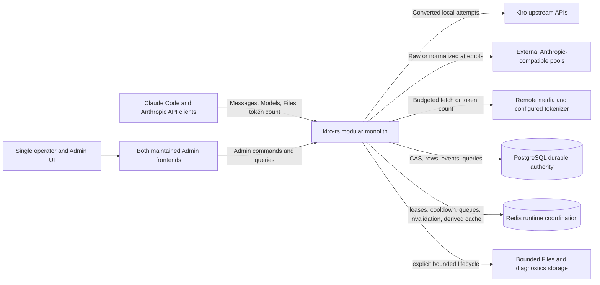
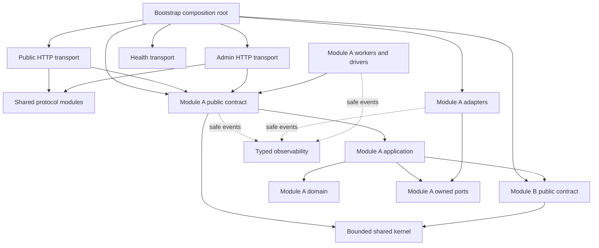

# Target System Architecture

Role: Accepted system-wide target architecture

Status: Accepted; implementation Not Started

Authority: Describes the binding target shape under decisions 007-014; it does not claim implementation evidence

As of: `v0.0.102` / `e9479df` / updated 2026-07-12

Read when: Evaluating a cross-module change, locating technical authority, deciding whether to introduce a service or trait, or checking whether a refactor matches the intended product

Related: [Plan root](../../README.md), [Topic index](../README.md), [Business context](../../../../baseline/business-context.md), [Current system context](../../../../baseline/system-context.md), [Module boundaries](module-boundaries-and-contracts.md), [Target module ledger](../../indexes/target-module-ledger.md), [Decision 007](../../decisions/007-domain-oriented-modular-monolith-and-module-ownership.md), [Decision 009](../../decisions/009-single-program-modular-build-and-final-cutover.md), [Decision 011](../../decisions/011-explicit-secret-envelope-and-resource-governor-authorities.md), [Decision 014](../../decisions/014-release-generation-recovery-and-rollback-state.md), [Runtime flows](runtime-control-and-data-flows.md), [State ownership](state-ownership-and-consistency.md), [Admin and frontend](admin-and-frontend-architecture.md), [Decision index](../../decisions/README.md)

## Authority Notice

The target is binding through decisions 001 and 003-014. Current behavior remains owned by source code and the dated baseline until the complete target is implemented and activated. Accepted target text is not evidence that current code already behaves this way.

## Product Boundary

`kiro-rs` is an Anthropic-compatible gateway operated in one trust domain by one operator. It accepts Anthropic and Claude Code traffic, routes it to a local Kiro credential pool or optional external Anthropic-compatible pools, translates protocols where required, preserves streaming semantics, projects cache usage, records usage and cost evidence, and exposes an Admin control plane.

Multiple request API keys are authentication and rotation credentials. Multiple Kiro credentials are upstream capacity. Multiple external pools are alternative upstream capacity. Multiple replicas are one deployment. None of these represent users or tenants. The target architecture therefore MUST NOT introduce tenant repositories, tenant-scoped authorization, tenant billing, tenant quotas, tenant file ownership, or tenant-based routing.

The single trust domain does not remove external boundaries. Clients, Kiro, external pools, remote media hosts, PgSQL, Redis, proxies, the filesystem, and diagnostic outputs remain independent protocol, security, capacity, and failure boundaries.

## Required Business Capabilities

The target must preserve these capabilities while implementation is migrated:

- Anthropic Messages, Models, token counting, and Files compatibility.
- `/v1`, `/cc/v1`, `/ha/v1`, `/na/v1`, and declared `/dfcache/{route}/v1` profiles.
- Claude Code stream ordering, thinking, tools, tool pairing, final usage, and normalized errors.
- Local Kiro model resolution, request conversion, payload repair, cache-point behavior, token refresh, and retry behavior.
- Multiple local credentials with priority, balancing, supported-model eligibility, sticky routing, warmup, RPM, concurrency, cooldown, queueing, and bounded attempts.
- External direct and fallback routing, raw and normalized request modes, model mapping, `preservePath`, independent concurrency, failover, and optional usage projection.
- Actual upstream usage, downstream reported usage, accounting/cost usage, cache evidence, latency, and attempt-chain observability.
- Runtime Admin changes to credentials, external pools, routing, scheduler, models, pricing, usage, and operational controls.
- Both maintained Admin frontends rebuilt against one Rust-authoritative generated contract, with workflow, accessibility, responsive, and browser-test coverage.
- Slow but valid upstream behavior, including long first-byte delays, long-running streams, tools, search, Files, MCP, and requests created by Claude Code multi-agent workflows.

## Goals

1. Give every durable or mutable state one named owner and one authority.
2. Separate pure decisions from I/O coordination and protocol transport.
3. Choose a concrete target before target-specific expensive body processing.
4. Read one immutable configuration snapshot for an entire request.
5. Keep streaming and retry behavior explicit as a state machine.
6. Make every queue, retained cache, downloaded source, transformed body, blocking workload, and diagnostic output bounded.
7. Move usage, audit, and runtime mutations through replayable, observable write paths.
8. Rewrite the complete core by module inside one target-only candidate, using offline characterization/comparison, deleting superseded source before final release and activating/rolling back only the complete system.
9. Improve performance through ownership, batching, client reuse, bounded concurrency, and reduced copying rather than assuming smaller files are faster.
10. Make reusable-secret cryptography and all process-wide weighted admission explicit single authorities rather than policies duplicated by business modules.
11. Fence deployment and recovery with one signed expected-instance release generation before any production traffic opens.

## Non-Goals

- Intermediate production releases that mix legacy and target business modules; implementation is modular but final activation is one complete-system cutover.
- Reuse of current God Objects inside target runtime; they are read-only behavior references and previous-release history only.
- An immediate microservice or separate-worker deployment.
- A public plugin ABI.
- Replacing PgSQL or Redis without evidence.
- Treating every module boundary as a trait.
- Reimplementing stable protocol parsers, SSE behavior, scheduling rules, or cache formulas without characterization.
- Changing existing endpoint behavior merely to simplify internals.
- Introducing users, tenants, organizations, or per-key data ownership.

## System Context



## Target Architectural Style

The target is a **domain-oriented modular monolith** with one composition root and one deployable binary. Stable `MOD-*` identities in the [target module ledger](../../indexes/target-module-ledger.md) define ownership. Domain, application, port, adapter, and worker are logical roles inside or immediately beside an owning capability module; they are not global dumping grounds. Control-plane, data-plane, worker, and adapter boundaries remain in-process until operational evidence justifies another deployment unit.



`AppA --> ApiB` represents a dependency on another module's public contract only. Module A cannot import Module B's private domain implementation, adapter records, worker queues, or state handles. Cyclic public-module dependencies are prohibited.

## Target Module Tree

The tree below illustrates ownership, not a requirement to create empty directories or move old files mechanically. The ledger, not the folder name, is the complete module registry. A stateful module may contain only the internal roles it needs.

```text
src/
├── bootstrap/                    # MOD-BOOTSTRAP composition only
├── shared/
│   ├── kernel/                   # MOD-KERNEL; no business policy or state
│   ├── protocol/
│   │   ├── anthropic/            # MOD-PROTO-ANTHROPIC
│   │   ├── kiro/                 # MOD-PROTO-KIRO
│   │   ├── external_anthropic/   # MOD-PROTO-EXTERNAL
│   │   └── sse/                  # MOD-PROTO-SSE
│   └── observability/            # MOD-OBSERVABILITY
├── platform/
│   ├── secret_envelope/          # MOD-SECRET-ENVELOPE
│   └── resource_governor/        # MOD-RESOURCE-GOVERNOR
├── transport/
│   ├── public_api/               # MOD-TRANSPORT-PUBLIC
│   ├── admin_api/                # MOD-TRANSPORT-ADMIN
│   └── health/                   # MOD-TRANSPORT-HEALTH
├── modules/
│   ├── runtime_config/           # domain/application/ports/adapters/workers as needed
│   ├── auth/
│   ├── model_catalog/            # Models API, aliases, capabilities and pricing owner
│   ├── credentials/
│   ├── proxy_resources/
│   ├── external_pools/
│   ├── scheduler_local/
│   ├── scheduler_external/
│   ├── messages/
│   ├── request_artifacts/
│   ├── payload/
│   ├── kiro_upstream/
│   ├── external_upstream/
│   ├── attempt_policy/
│   ├── response/
│   ├── terminal_lifecycle/
│   ├── terminal_journal/
│   ├── usage/
│   ├── prompt_cache/
│   ├── files/
│   ├── media/
│   ├── token_count/
│   ├── audit/
│   ├── maintenance_jobs/
│   └── diagnostics/
├── lifecycle/
│   ├── migrations/
│   ├── supervisor/
│   ├── readiness/
│   └── recovery/
└── validation/                   # architecture/contract/load/real-client/release harnesses

admin-ui/                         # MOD-ADMIN-UI
ui/                               # MOD-OPERATOR-UI
```

There is no broad target `application`, `ports`, `adapters`, `workers`, or `admin` owner. Admin transport dispatches to domain-owner command/query contracts. Shared connection-pool helpers may exist as infrastructure primitives, but domain SQL, Redis keys/scripts, filesystem records, queues, and migrations remain owned by the corresponding module.

## Component Responsibilities

| Component | Owns | Does not own |
| --- | --- | --- |
| Bootstrap | boot configuration, dependency construction, migration prerequisites/order/public-contract invocation, startup order, and process assembly | domain migration definitions/SQL/checkpoints, business policy, task-supervisor state, readiness decisions, or request branching |
| Migrations | common manifest protocol/validation, fenced runner, active-run/applied/adopted/checkpoint ledger mechanics and migration inspection/resume/abort/reconciliation | domain manifest instances or SQL/DDL, backup/restore, Redis rebuild, composition order or business state authority |
| Recovery | backup/restore verification, Redis rebuild/epoch, previous-binary profile and cross-authority forward recovery | migration runner/ledger, domain SQL/DDL, normal composition or business state authority |
| Secret envelope | versioned XChaCha20-Poly1305 seal/open/rewrap, key-ring metadata and non-secret envelope validation | API-key plaintext recovery, domain persistence, browser secrets or key material stored in PgSQL |
| Resource governor | the single weighted process ledger, admission/reservation/upgrade/release state, listener/stream/body/control-plane reserves and low-memory fail-closed validation | business eligibility, scheduler fairness, media semantics or direct ownership of another module's queue |
| Public transport | listener/header/body/keepalive/H2 limits, authentication, pre-body resource admission, endpoint profile and wire decoding/encoding | target selection, SQL, Redis, retry classification or unbounded complete-body allocation |
| Admin transport | Admin authentication, pre-body resource admission, request validation and command/query DTOs | direct mutation of manager internals or storage rows, generic transactions or unbounded complete-body allocation |
| Protocol | Anthropic, Kiro, external, and SSE wire formats/state machines | persistence, scheduling, route policy |
| Domain module | one capability's application orchestration, invariants, public contracts, owned ports and state authority | unrelated use cases, another module's private state, or a global service context |
| Module adapters | the owner's PgSQL, Redis, upstream HTTP, DNS, proxy, or filesystem implementation | product policy hidden inside I/O helpers or another owner's persistence |
| Module workers | bounded owner-specific batching, replay, cleanup, refresh, invalidation, and drain | detached tasks, unbounded queues, or business branching for unrelated modules |
| Model catalog | public Models semantics, aliases, capabilities, pricing, validated refresh and immutable catalog publication | a second mutable model map in routing, Admin, usage, or transport |
| Proxy resources | durable reusable-proxy catalog, secret lifecycle, validation/test, credential binding resolution and immutable publication | scheduler queue/lease policy, Kiro attempt retry policy, or generic HTTP-client ownership |
| Shared kernel | IDs, versions, time/deadline, cancellation and bounded error primitives | repositories, services, route/scheduler/usage policy, provider DTOs, or mutable state |
| Observability | metrics, trace fields, safe diagnostic events | raw secret or request-body retention by default |

## Data Plane Shape

A request enters through public transport under fixed listener, slow-header, keepalive and HTTP/2 stream ceilings. After header authentication and endpoint/profile resolution, transport calls the `PUBLIC(MOD-RUNTIME-CONFIG)` `capture()` contract exactly once. The raw complete snapshot remains private to `MOD-RUNTIME-CONFIG`; capture returns a `CapturedRuntime` bundle containing only versioned narrow routing, scheduler, processing, usage and resource views. Before reading the request body, transport acquires a scoped `MOD-RESOURCE-GOVERNOR` admission handle from that captured policy: `Content-Length` reserves the accepted byte/cost class up front, while chunked input upgrades the reservation per bounded chunk and rejects before further allocation when the ceiling cannot be raised. Transport creates a `RequestEnvelope` containing `BoundedRawBody`, not unconstrained `Bytes`, and passes the envelope plus bundle to `MOD-MESSAGES`. Messages distributes those views without loading or retaining the raw configuration graph, probes only facts needed for early routing, selects a route and concrete target, builds a target-specific `ProcessingPlan`, executes bounded attempts, and translates or passes through the selected response. It supplies neutral terminal signals to `MOD-TERMINAL-LIFECYCLE`, which alone decides the immutable `TerminalPlan`.

Under the accepted terminal contract, stable child IDs identify only lease completion, credential outcome and usage event obligations. `MOD-AUDIT` remains the authority for security/configuration audit events, not an implicit per-request terminal participant. Adding any later request-terminal effect requires an explicit decision, one typed obligation ID and a technical-authority contract; it cannot enter through a generic effects collection.

Raw external passthrough remains a distinct capability. It may probe or rewrite the top-level model only when configured, but it does not implicitly parse or normalize the request. Usage projection remains independent from body mode.

The local Kiro path and external normalized path may share canonical Anthropic parsing and request facts, but they own separate outbound-body pipelines. No unselected pipeline may perform remote fetch, PDF extraction, token counting, schema normalization, payload shaping, or serialization.

## Control Plane Shape

Admin endpoints invoke application commands. A command validates an expected version, changes one aggregate or row in PgSQL, records a change/audit event in the same transaction, publishes a best-effort fast invalidation, and installs a new immutable snapshot locally. Other replicas reload through invalidation and periodic version checks.

Admin writes never mutate a broad in-memory object first and later attempt to save it. Queries use read repositories or purpose-built projections instead of reaching through the data-plane manager.

## Worker Shape

All background activity belongs to a named `TaskSupervisor`. A worker is registered to one owning module and has a bounded input, retry policy, progress counters, readiness impact, drain contract, and terminal report. Business modules may enqueue an owner-typed command or event; they may not call an untracked `tokio::spawn` or route unrelated business work through a shared worker.

Terminal/outbox dispatch, usage, audit, catalog sync, runtime mutation, cleanup, refresh, and invalidation workers can remain tasks in the same process. A later decision may deploy one separately only after its port and state authority are already stable.

## Performance Shape

- Runtime policies and catalogs are immutable `Arc` snapshots, not repeatedly cloned configuration graphs.
- The scheduler reads a batched dynamic-state snapshot and performs pure in-process ranking; it does not perform Redis I/O per candidate.
- Raw request chunks may use `Bytes` internally, but downstream modules receive only `BoundedRawBody` bound to a governor handle; parsed and transformed artifacts are request-scoped and versioned to avoid stale token counts or repeated serialization.
- Network clients are reused by stable TLS/proxy configuration.
- PgSQL writes use row-level updates and batch/event writers rather than full snapshots and sequential rollups.
- Redis operations that change one logical state transition are atomic Lua or transactional operations.
- Blocking PDF/tokenizer/CPU work uses supervised bounded executors and scoped weighted handles whose permit state remains owned by `MOD-RESOURCE-GOVERNOR`.
- Streaming uses backpressure and holds its lease until completion, error, or downstream cancellation.

These are target properties. They do not claim that the current implementation already meets them.

## Security And Resource Shape

Authentication is global to the single trust domain, but secrets and external connections retain strict boundaries. Admin and request API keys are separately versioned and stored only as keyed constant-time verifiers, fingerprints and epochs; plaintext exists only in the create/rotate response. Credentials, proxy passwords, external-pool keys and other values that must be replayed upstream are sealed by `MOD-SECRET-ENVELOPE` with an externally recoverable versioned key ring. External request and response headers use allowlists. Remote URL validation pins the checked address to the actual connection and revalidates every redirect.

Every request carries explicit body, remote-source, transformed-byte, blocking-work, queue, and operation-timeout budgets. `MOD-RESOURCE-GOVERNOR` is the only mutable weighted admission ledger; transports and business modules hold scoped handles but cannot mint or mutate permits. Every process-retained structure and pre-authentication connection/stream has a count, byte, age, or concurrency bound, and a configuration whose reserved minima cannot fit the declared memory/FD/pool budget fails startup/readiness closed. Debug body capture is off by default and, when explicitly enabled, has a directory quota, retention policy, safe permissions, field filtering, and a visible drop outcome.

## Deployment And Availability

Multi-replica production is supported under decision 010 without changing the product model. PgSQL is durable authority; Redis is bounded shared coordination/derived state; memory is a versioned snapshot/request workspace; shared Files are PgSQL-backed and other filesystem data has an explicit bounded/loss lifecycle.

Each deployment and rollback is bound to a signed `ReleaseGenerationManifest` containing the expected instance set plus backend, frontend, schema, configuration and release digests. All expected instances must attest the same generation while readiness/load-balancer admission is closed; missing or mismatched instances and any unfenced old generation keep traffic closed. Redis-loss recovery uses that manifest to re-register active leases or reserve/fence missing-instance capacity before admission can reopen.

Redis scheduling failure is fail-closed; there is no unsafe process-local production scheduler fallback. PgSQL runtime failure may use an already captured request snapshot, but control-plane writes and any operation requiring durable acceptance fail closed; backlog/residue policy controls readiness under decision 010.

## Architectural Implementation Conditions

The complete target must prove:

1. all public endpoint and Claude Code invariants are linked to characterization tests;
2. the dependency rules can be enforced by module visibility or a static architecture check;
3. every state in the ownership matrix has one authority and documented failure semantics;
4. request, scheduler, config, usage, external-pool, readiness, and shutdown flows have focused contracts;
5. offline comparison does not call a real upstream or repeat another side effect;
6. migrations are expand-contract and a binary rollback does not require destructive schema rollback;
7. queue, memory, remote-source, filesystem, and blocking-work limits have measurable acceptance tests;
8. performance gates compare against a same-host baseline rather than relying on source-file size;
9. decisions 007-014 remain satisfied without a target architecture exception;
10. every target path, state, public contract, dependency, legacy responsibility mapping, integration result and deletion slot resolves to one of 50 `MOD-*` entries;
11. static checks reject cross-module private imports, every target-runtime legacy import, broad service locators, mega contexts/preludes and downstream reads of the complete runtime snapshot;
12. the final release contains no module selector/fallback/stub and whole-system cutover/rollback rehearsal passes.
